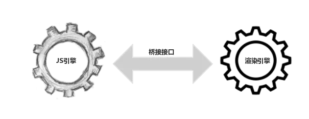

# DOM 优化原理与基本实践
## DOM 为什么这么慢
JS 引擎和渲染引擎（浏览器内核）是独立实现的。当我们用 JS 去操作 DOM 时，本质上是 JS 引擎和渲染引擎之间进行了“跨界交流”。这个“跨界交流”的实现并不简单，它依赖了桥接接口作为“桥梁”（如下图）。

我们每操作一次 DOM（不管是为了修改还是仅仅为了访问其值），都要过一次“桥”（从）。过“桥”的次数一多，就会产生比较明显的性能问题。因此“减少 DOM 操作”的建议，并非空穴来风。


很多时候，我们对 DOM 的操作都不会局限于访问，而是为了修改它。当我们对 DOM 的修改会引发它外观（样式）上的改变时，就会触发回流或重绘。

- 回流：当我们对 DOM 的修改引发了 DOM 几何尺寸的变化（比如修改元素的宽、高或隐藏元素等）时，浏览器需要重新计算元素的几何属性（其他元素的几何属性和位置也会因此受到影响），然后再将计算的结果绘制出来。这个过程就是回流（也叫重排）。

- 重绘：当我们对 DOM 的修改导致了样式的变化、却并未影响其几何属性（比如修改了颜色或背景色）时，浏览器不需重新计算元素的几何属性、直接为该元素绘制新的样式（跳过了上图所示的回流环节）。这个过程叫做重绘。
我们在开发中，要从代码层面出发，尽可能把回流和重绘的次数最小化

- 减少 DOM 操作：少交“过路费”、避免过度渲染
```html
<!DOCTYPE html>
<html lang="en">
<head>
  <meta charset="UTF-8">
  <meta name="viewport" content="width=device-width, initial-scale=1.0">
  <meta http-equiv="X-UA-Compatible" content="ie=edge">
  <title>DOM操作测试</title>
</head>
<body>
  <div id="container"></div>
</body>
</html>
```
此时我有一个假需求——我想往 container 元素里写 10000 句一样的话。如果我这么做：
```javascript
for(var count=0;count<10000;count++){ 
  document.getElementById('container').innerHTML+='<span>我是一个小测试</span>'
} 
```
这段代码有两个明显的可优化点。
我们每一次循环都调用 DOM 接口重新获取了一次 container 元素，相当于每次循环都交了一次过路费。前后交了 10000 次过路费，但其中 9999 次过路费都可以用缓存变量的方式节省下来：

```javascript
// 只获取一次container
let container = document.getElementById('container')
for(let count=0;count<10000;count++){ 
  container.innerHTML += '<span>我是一个小测试</span>'
} 
```
不必要的 DOM 更改太多了。我们的 10000 次循环里，修改了 10000 次 DOM 树。我们前面说过，对 DOM 的修改会引发渲染树的改变、进而去走一个（可能的）回流或重绘的过程，而这个过程的开销是很“贵”的。这么贵的操作，我们竟然重复执行了 N 多次！其实我们可以通过就事论事的方式节省下来不必要的渲染：
```javascript
let container = document.getElementById('container')
let content = ''
for(let count=0;count<10000;count++){ 
  // 先对内容进行操作
  content += '<span>我是一个小测试</span>'
} 
// 内容处理好了,最后再触发DOM的更改
container.innerHTML = content
```
所以JS 层面的事情，JS 自己去处理，处理好了，再来找 DOM 打报告。

事实上，考虑JS 的运行速度，比 DOM 快得多这个特性。我们减少 DOM 操作的核心思路，就是让 JS 去给 DOM 分压。

这个思路，在 DOM Fragment 中体现得淋漓尽致。

> DocumentFragment 接口表示一个没有父级文件的最小文档对象。它被当做一个轻量版的 Document 使用，用于存储已排好版的或尚未打理好格式的XML片段。因为 DocumentFragment 不是真实 DOM 树的一部分，它的变化不会引起 DOM 树的重新渲染的操作（reflow），且不会导致性能等问题。

相比之下，DOM Fragment 可以帮助我们用更加结构化的方式去达成同样的目的，从而在维持性能的同时，保住我们代码的可拓展和可维护性。我们现在用 DOM Fragment 来改写上面的例子：

```javascript
let container = document.getElementById('container')
// 创建一个DOM Fragment对象作为容器
let content = document.createDocumentFragment()
for(let count=0;count<10000;count++){
  // span此时可以通过DOM API去创建
  let oSpan = document.createElement("span")
  oSpan.innerHTML = '我是一个小测试'
  // 像操作真实DOM一样操作DOM Fragment对象
  content.appendChild(oSpan)
}
// 内容处理好了,最后再触发真实DOM的更改
container.appendChild(content)
```
我们运行这段代码，可以得到与前面两种写法相同的运行结果。
可以看出，DOM Fragment 对象允许我们像操作真实 DOM 一样去调用各种各样的 DOM API，我们的代码质量因此得到了保证。并且它的身份也非常纯粹：当我们试图将其 append 进真实 DOM 时，它会在乖乖交出自身缓存的所有后代节点后全身而退，完美地完成一个容器的使命，而不会出现在真实的 DOM 结构中。


# 事件的节流（throttle）与防抖（debounce）

scroll事件是一个非常容易被反复触发的事件。其实不止 scroll 事件，resize 事件、鼠标事件（比如 mousemove、mouseover 等）、键盘事件（keyup、keydown 等）都存在被频繁触发的风险，频繁触发回调导致的大量计算会引发页面的抖动甚至卡顿。为了规避这种情况，我们需要一些手段来控制事件被触发的频率。


“节流”与“防抖”的本质
这两个东西都以闭包的形式存在。
它们通过对事件对应的回调函数进行包裹、以自由变量的形式缓存时间信息，最后用 setTimeout 来控制事件的触发频率。


Throttle： 第一个人说了算
- throttle 的中心思想在于：在某段时间内，不管你触发了多少次回调，我都只认第一次，并在计时结束时给予响应。

先给大家讲个小故事：现在有一个旅客刚下了飞机，需要用车，于是打电话叫了该机场唯一的一辆机场大巴来接。司机开到机场，心想来都来了，多接几个人一起走吧，这样这趟才跑得值——我等个十分钟看看。于是司机一边打开了计时器，一边招呼后面的客人陆陆续续上车。在这十分钟内，后面下飞机的乘客都只能乘这一辆大巴，十分钟过去后，不管后面还有多少没挤上车的乘客，这班车都必须发走。

“司机” 就是我们的节流阀，他控制发车的时机；“乘客”就是因为我们频繁操作事件而不断涌入的回调任务，它需要接受“司机”的安排；而“计时器”，就是我们上文提到的以自由变量形式存在的时间信息，它是“司机”决定发车的依据；最后“发车”这个动作，就对应到回调函数的执行。
> ###### 总结下来，所谓的“节流”，是通过在一段时间内无视后来产生的回调请求来实现的。

对应到实际的交互：每当用户触发了一次 scroll 事件，我们就为这个触发操作开启计时器。一段时间内，后续所有的 scroll 事件都会被当作“一辆车的乘客”——它们无法触发新的 scroll 回调。直到“一段时间”到了，第一次触发的 scroll 事件对应的回调才会执行，而“一段时间内”触发的后续的 scroll 回调都会被节流阀无视掉。

例子：

```javascript
// fn是我们需要包装的事件回调, interval是时间间隔的阈值
function throttle(fn, interval) {
  // last为上一次触发回调的时间
  let last = 0
  
  // 将throttle处理结果当作函数返回
  return function () {
      // 保留调用时的this上下文
      let context = this
      // 保留调用时传入的参数
      let args = arguments
      // 记录本次触发回调的时间
      let now = +new Date()
      
      // 判断上次触发的时间和本次触发的时间差是否小于时间间隔的阈值
      if (now - last >= interval) {
      // 如果时间间隔大于我们设定的时间间隔阈值，则执行回调
          last = now;
          fn.apply(context, args);//为了防止传null的情况
      }
    }
}

// 用throttle来包装scroll的回调
const better_scroll = throttle(() => console.log('触发了滚动事件'), 1000)

document.addEventListener('scroll', better_scroll)
```

Debounce： 最后一个人说了算
- 防抖的中心思想在于：我会等你到底。在某段时间内，不管你触发了多少次回调，我都只认最后一次。

继续讲司机开车的故事。这次的司机比较有耐心。第一个乘客上车后，司机开始计时（比如说十分钟）。十分钟之内，如果又上来了一个乘客，司机会把计时器清零，重新开始等另一个十分钟（延迟了等待）。直到有这么一位乘客，从他上车开始，后续十分钟都没有新乘客上车，司机会认为确实没有人需要搭这趟车了，才会把车开走。

> ###### 我们对比 throttle 来理解 debounce：在throttle的逻辑里，“第一个人说了算”，它只为第一个乘客计时，时间到了就执行回调。而 debounce 认为，“最后一个人说了算”，debounce 会为每一个新乘客设定新的定时器。


```javascript
// fn是我们需要包装的事件回调, delay是每次推迟执行的等待时间
function debounce(fn, delay) {
  // 定时器
  let timer = null
  
  // 将debounce处理结果当作函数返回
  return function () {
    // 保留调用时的this上下文
    let context = this
    // 保留调用时传入的参数
    let args = arguments

    // 每次事件被触发时，都去清除之前的旧定时器
    if(timer) {
        clearTimeout(timer)
    }
    // 设立新定时器
    timer = setTimeout(function () {
      fn.apply(context, args)
    }, delay)
  }
}

// 用debounce来包装scroll的回调
const better_scroll = debounce(() => console.log('触发了滚动事件'), 1000)

document.addEventListener('scroll', better_scroll)
```

用 Throttle 来优化 Debounce

debounce 的问题在于它“太有耐心了”。试想，如果用户的操作十分频繁——他每次都不等 debounce 设置的 delay 时间结束就进行下一次操作，于是每次 debounce 都为该用户重新生成定时器，回调函数被延迟了不计其数次。频繁的延迟会导致用户迟迟得不到响应，用户同样会产生“这个页面卡死了”的观感。

为了避免弄巧成拙，我们需要借力 throttle 的思想，打造一个“有底线”的 debounce——等你可以，但我有我的原则：delay 时间内，我可以为你重新生成定时器；但只要delay的时间到了，我必须要给用户一个响应。

```javascript
// fn是我们需要包装的事件回调, delay是时间间隔的阈值
function throttle(fn, delay) {
  // last为上一次触发回调的时间, timer是定时器
  let last = 0, timer = null
  // 将throttle处理结果当作函数返回
  
  return function () { 
    // 保留调用时的this上下文
    let context = this
    // 保留调用时传入的参数
    let args = arguments
    // 记录本次触发回调的时间
    let now = +new Date()
    
    // 判断上次触发的时间和本次触发的时间差是否小于时间间隔的阈值
    if (now - last < delay) {
    // 如果时间间隔小于我们设定的时间间隔阈值，则为本次触发操作设立一个新的定时器
       clearTimeout(timer)
       timer = setTimeout(function () {
          last = now
          fn.apply(context, args)
        }, delay)
    } else {
        // 如果时间间隔超出了我们设定的时间间隔阈值，那就不等了，无论如何要反馈给用户一次响应
        last = now
        fn.apply(context, args)
    }
  }
}

// 用新的throttle包装scroll的回调
const better_scroll = throttle(() => console.log('触发了滚动事件'), 1000)

document.addEventListener('scroll', better_scroll)
```


分享：`丁紫伊`
