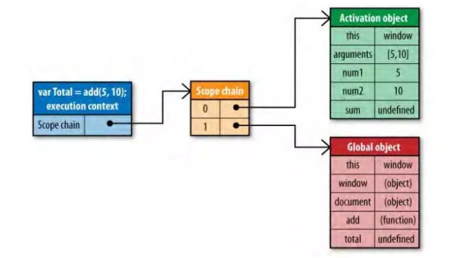
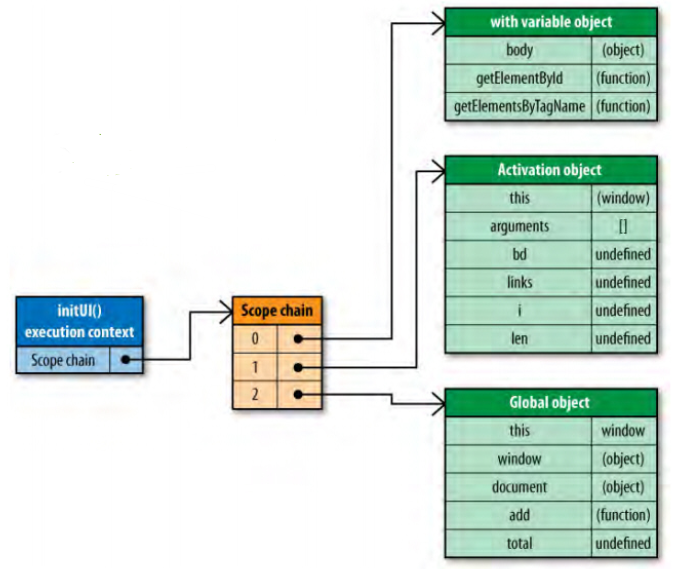

# 网站性能优化（二）

    网站性能优化分为多种类型，本次主要讲述js代码方面的优化。

## 作用域链对性能的影响

**作用域（也称为执行上下文),当函数被创建时，JavaScript引擎会把创建时执行上下文的作用域链赋给函数内部属性[Scope]。当函数执行时，创建一个活动对象，添加到作用域链顶部。**

```javascript
function add(num1,num2) {
    var sum = num1 + num2;
    return sum;
}
```

当在函数add创建时，它的作用域链中会填入一个全局对象，该全局对象包含了所有全局变量

函数add的作用域将会在执行时用到。例如执行如下代码：

```javascript
var total = add(5,10);
```

- 执行此函数时会创建一个称为“运行期上下文(execution context)”的内部对象，每个运行期上下文都有自己的作用域链，用于标识符解析
- 这些值按照它们出现在函数中的顺序被复制到运行期上下文的作用域链中。它们共同组成了一个新的对象，叫“活动对象(activation object)”，该对象包含了函数的所有局部变量、命名参数、参数集合以及this
- 此对象会被推入作用域链的前端，当运行期上下文被销毁，活动对象也随之销毁

新的作用域链如下图所示：


从作用域链的结构可以看出，在运行期上下文的作用域链中，标识符所在的位置越深，读写速度就会越慢。全局变量总是存在于运行期上下文作用域链的最末端，因此在标识符解析的时候，查找全局变量是最慢的。

- 如果一个跨作用域的对象被引用了一次以上，则先把它存储到局部变量里再使用。

```javascript
funtion init(){
    var doc = document,
        bd = doc.body;
        
        doc.getElementById('test').onclick = function(){}
        
        bd.className = '';
}
```


### 既然作用域对性能有影响，那么我们去临时改变作用域又会如何？

**with语句和try-catch可以临时改变作用域**

（1）with语句是对象的快捷应用方式，用来避免书写重复代码。使用width语句来避免多次书写document，看上去更高效，实际上产生了性能问题。

```javascript
function initUI(){
    with(document){
        var bd=body,
            links=getElementsByTagName("a"),
            i=0,
            len=links.length;
        while(i < len){
            update(links[i++]);
        }
        getElementById("btnInit").onclick=function(){
            doSomething();
        };
    }
}
```

新的作用域链如下图所示：


- 当代码运行到with语句时，运行期上下文的作用域链临时被改变。创建一个新的可变对象（document），它包含了参数指定的对象的所有属性。这个对象将被推入作用域链的头部，这意味着函数的所有局部变量现在处于第二个作用域链对象中，因此访问代价更高了。

（2）另外一个会改变作用域链的是try-catch语句中的catch语句。当try代码块中发生错误时，执行过程会跳转到catch语句，然后把异常对象推入一个可变对象并置于作用域的头部。在catch代码块内部，函数的所有局部变量将会被放在第二个作用域链对象中。

```javascript
try{
    doSomething();
}catch(ex){
    alert(ex.message); //作用域链近在此处改变
}
```

一旦catch语句执行完毕，作用域链机会返回到之前的状态。try-catch语句在代码调试和异常处理中经常使用，我们可以通过优化代码来简化catch语句代码，最好没有局部变量的访问。

```javascript
try{
    init()
} catch(error) {
    handleError(error)
}
```

## 优化循环

    （1）循环次数为变量的情况

```javascript
for (let i=0;i< arr.length;i++){
    //do something
}
```

    这种写法有一个很明显的缺点，就是每次一循环，我们都需要去读取一次数组arr的长度。

    （2）优化写法
```javascript
for (let i=0,len=arr.length;i<len;i++){
    //do something
}
```

    可以将长度进行存储，之后循环无需再去读取长度

## 总结

    以上都是与数据读取速度有关，在代码编写中，尽可能的减少全局变量访问的次数，跨作用域访问对象多次时，可以将该对象存储到局部变量再使用。尽量少用with语句，因为with语句会增加其中执行代码的作用域链的长度。


分享：`罗东蓉`