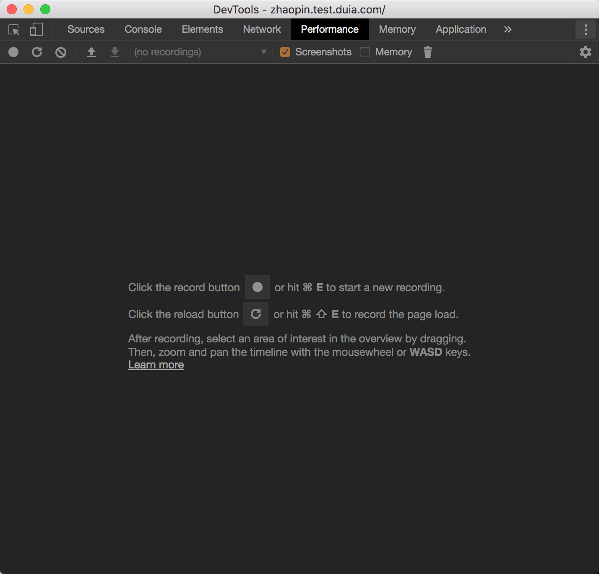
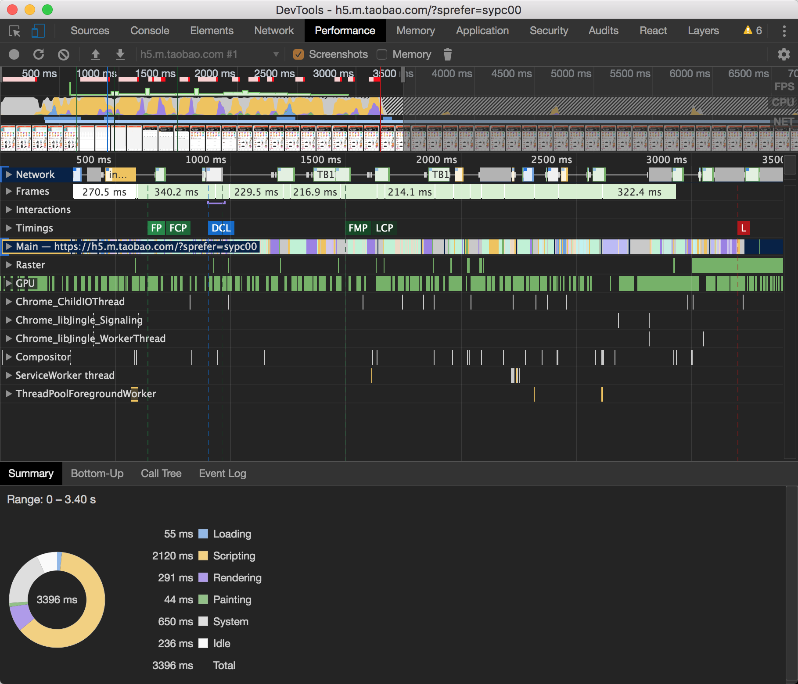
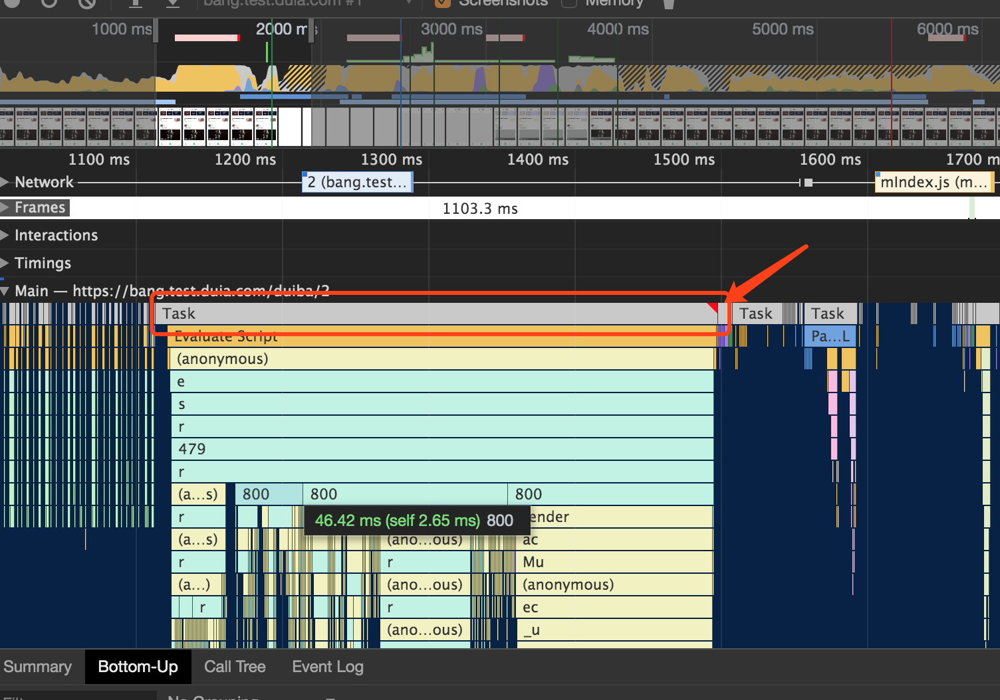

## 一、Preload

`<link>` 标签最常见的应用情形就是被用来加载 CSS 文件，进而装饰你的页面：

```html
<link rel="stylesheet" href="xxx.css" />
```

preload 的用法：

```html
<link rel="preload" href="xxx.css" as="style" />

<link rel="preload" href="xxx.js" as="script" />
```

支持的有`audio` `embed` `font` `image` `video` `style` `script` `document`等

[参考链接: 通过 rel="preload"进行内容预加载](https://developer.mozilla.org/zh-CN/docs/Web/HTML/Preloading_content)

---

## 二、Performance 工具

`Performance` 这个一般很少用到；但是如果我们要做到极致的优化，可能就会用到这个玩意儿 `Performance`。

#### 干什么的？

- 可视化图形界面
- 每毫秒做的事情
- 文件的执行加载的顺序
- 每毫秒界面展示的效果
- 每个方法执行的顺序和时间（由下至上）
- 倒置的事件火焰图（由下至上）
- 数据总结

#### 什么样的？

谷歌浏览器打开，打开开发者工具找到查看 dom 元素的箭头，顺着往后查找一个叫`Performance`的；
里面有`概述` `Network` `Interactions` `Timings` `Main` `Raster` `GPU` `TaskSchedulerForegroundBlockingWorker` `Memory` `性能检测详情`等





[参考链接: 性能优化篇 - Performance（工具 & api）](https://juejin.im/post/5c8fa71d5188252d785f0ea3)

---

## 三、像素管道

从纯粹的数学角度而言，每帧的预算约为 16ms（1000ms / 60 帧 = 16.67ms/帧）。 但因为浏览器需要花费时间将新帧绘制到屏幕上，**只有 10 毫秒来执行代码**。

如果无法符合此预算，帧率将下降，并且内容会在屏幕上抖动。 此现象通常称为**卡顿**，会对用户体验产生负面影响。

而浏览器花费时间进行绘制的过程就是执行像素管道的过程。

如图：

这个过程一般我们叫`重排`，也就是改变了元素的几何属性（例如宽度、高度、左侧或顶部位置等），浏览器会检查所有元素，然后“自动重排”页面。任何受影响的部分都需要重新绘制，而且最终绘制的元素需进行合成，重排进行了管道的每一步，性能受到较大影响。


这个就是我们说的`重绘`，也就是修改“paint only”属性（例如背景图片、文字颜色或阴影等），不会影响页面布局的属性，然后就不会重新进行布局


这个过程不会重排也不会重绘，仅仅是进行合成，也就是修改 transform 和 opacity 属性更改来实现动画。

查看影响重排重绘合成的 css 属性，[👉 点击这里](https://csstriggers.com/)

---

## 四、什么样的网页才算流畅？

#### 关于动画加载与人们的反应

- 
- 一个动作的响应，一般建议一般在 100 毫秒内解决。
- 需要超过 500 毫秒才能完成的操作，始终要让用户觉得还在动，例如 `Loading` `骨架屏`等。

#### 网页与用户之间

**在网页与用户产生交互的过程中，让用户感觉流畅。**

一般网页与用户产生的交互分为两种：`主动交互` `被动交互`

```
主动交互：用户用鼠标或者键盘去操作网页发生的交互
被动交互：像动画、轮播的等等
```

- 在主动交互过程中怎么才算流畅呢？

在很多人的实践过程中发现 `100ms` 是一个临界值，超过了 `100ms` 用户就会觉得有卡顿、不流畅，所以不超过`100ms`会让用户觉得流畅。

- 被动交互怎么才算流畅？

这里有一个**屏幕刷新频率**的概念，即图像在屏幕上更新的速度，也即屏幕上的图像每秒钟出现的次数，它的单位是赫兹(Hz)。 对于一般笔记本电脑，这个频率大概是 `60Hz`。因此当你对着电脑屏幕什么也不做的情况下，显示器也会以每秒 `60` 次的频率正在不断的更新屏幕上的图像。因为人的眼睛有`视觉停留效应`（即前一副画面留在大脑的印象还没消失，紧接着后一副画面就跟上来了，这中间只间隔了 `16.7ms(1000/60≈16.7)`， 所以会让你误以为屏幕上的图像是静止不动的。），所以我们感觉不到这个变化。如果我们的网页也可以每秒钟往屏幕传输 `60`个画面，用户就会觉得这个网页是流畅的，换算下来，每一帧是 `16.7ms`。

小结：响应时间保持在 `100ms` 以内，动画要 `16.7ms` 传输一帧到屏幕上，空闲任务不能超过 `50ms`，其实不只是空闲任务，所有任务都不能超过 `50ms`，加载时间是 `1000ms`，所谓的页面秒开就是从这里来的，这个也叫：RAIL（Response、Animation、Idle、Load）。

---

## 五、Task Slice

在 Performance 中，里面有个 task 的东西，有红色小三角的，这个任务很长，会阻塞主线程。我们怎么才能把长任务缩短时长成小任务呢？


`任务切片`：把每一个任务去做切片，缩短任务的执行时长，加快任务的渲染

```javascript
function* sliceQueue({ sliceList, callback }) {
  let listOrNum = sliceList; //假设是数字
  for (let i = 0; i < listOrNum; ++i) {
    const start = performance.now();
    callback(i);
    while (performance.now() - start < 16.7) {
      yield;
    }
  }
}
```

有些性能优化，其实真的和想象当中，不一样

```javascript
var count = 5;
for (var i = 0; i < count; ++i) {
  var div = document.createElement('div');
  document.body.appendChild(div);
}
```

对比：

```javascript
var count = 5;
var fragment = document.createDocumentFragment();
for (var i = 0; i < count; ++i) {
  var div = document.createElement('div');
  fragment.appendChild(div);
}
document.body.appendChild(fragment);
```

有兴趣的可以去看看 React 的时间切片（Time Slicing）

### 参考链接

- [如何实现和淘宝移动端一样的模块化加载](https://juejin.im/post/5d33fd0f5188256e820c80d4)
- [Task-slice 实现淘宝移动端方式加载](https://juejin.im/post/5d37ce6f6fb9a07efd474d78)
- [任务切片](https://github.com/nextdoorUncleLiu/task-slice/blob/master/demo/src/index.js)
- [https://juejin.im/post/5c8a1db15188257e9044ec52](https://juejin.im/post/5c8a1db15188257e9044ec52)
- [性能优化之关于像素管道](https://juejin.im/post/5d1492bbe51d4556bc066fb5)
- [时间切片（Time Slicing）](https://juejin.im/post/5ce249896fb9a07ea712e26e)
- [让你的网页更丝滑](https://juejin.im/post/5cf2161af265da1bb80c15fb)

---

by `虚竹`
