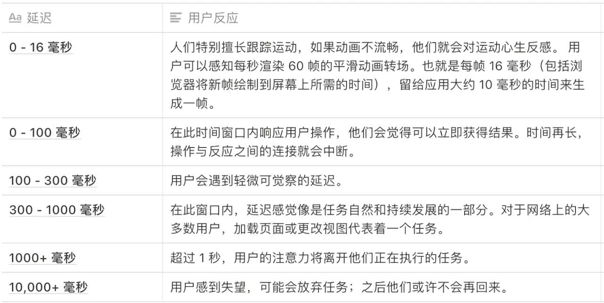

### Preload

`<link>` 标签最常见的应用情形就是被用来加载 CSS 文件，进而装饰你的页面：

```html
<link rel="stylesheet" href="xxx.css" />
```

```html
<link rel="preload" href="xxx.css" as="style" />

<link rel="preload" href="xxx.js" as="script" />
```

支持的有`audio` `embed` `font` `image` `video` `style` `script` `document`等

[参考链接: 通过 rel="preload"进行内容预加载](https://developer.mozilla.org/zh-CN/docs/Web/HTML/Preloading_content)

---

### Performance 工具

`Performance` 这个一般很少用到；但是如果我们要做到极致的优化，可能就会用到这个玩意儿 `Performance`。

##### 干什么的？

- 可视化图形界面
- 每毫秒做的事情
- 文件的执行加载的顺序
- 每毫秒界面展示的效果
- 每个方法执行的顺序和时间（由下至上）
- 倒置的事件火焰图（由下至上）
- 数据总结

##### 什么样的？

谷歌浏览器打开，打开开发者工具找到查看 dom 元素的箭头，顺着往后查找一个叫`Performance`的；
里面有`概述` `Network` `Interactions` `Timings` `Main` `Raster` `GPU` `TaskSchedulerForegroundBlockingWorker` `Memory` `性能检测详情`等

[参考链接: 性能优化篇 - Performance（工具 & api）](https://juejin.im/post/5c8fa71d5188252d785f0ea3)

---

### task-slice

##### 关于动画加载与人们的反应



- 一个动作的响应，一般建议一般在 100 毫秒内解决。
- 需要超过 500 毫秒才能完成的操作，始终要让用户觉得还在动，例如 `Loading` `骨架屏`等。

##### 像素管道

从纯粹的数学角度而言，每帧的预算约为 16 毫秒（1000 毫秒 / 60 帧 = 16.66 毫秒/帧）。 但因为浏览器需要花费时间将新帧绘制到屏幕上，_只有 10 毫秒来执行代码_。

如果无法符合此预算，帧率将下降，并且内容会在屏幕上抖动。 此现象通常称为*卡顿*，会对用户体验产生负面影响。

而浏览器花费时间进行绘制的过程就是执行像素管道的过程。

#### 参考链接

- [如何实现和淘宝移动端一样的模块化加载](https://juejin.im/post/5d33fd0f5188256e820c80d4)
- [Task-slice 实现淘宝移动端方式加载](https://juejin.im/post/5d37ce6f6fb9a07efd474d78)
- [任务切片](https://github.com/nextdoorUncleLiu/task-slice/blob/master/demo/src/index.js)
- [https://juejin.im/post/5c8a1db15188257e9044ec52](https://juejin.im/post/5c8a1db15188257e9044ec52)
- [性能优化之关于像素管道](https://juejin.im/post/5d1492bbe51d4556bc066fb5)
- [时间切片（Time Slicing）](https://juejin.im/post/5ce249896fb9a07ea712e26e)
- [让你的网页更丝滑](https://juejin.im/post/5cf2161af265da1bb80c15fb)
