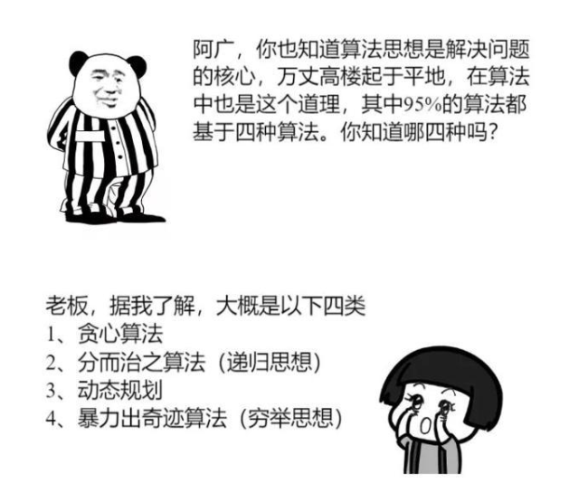
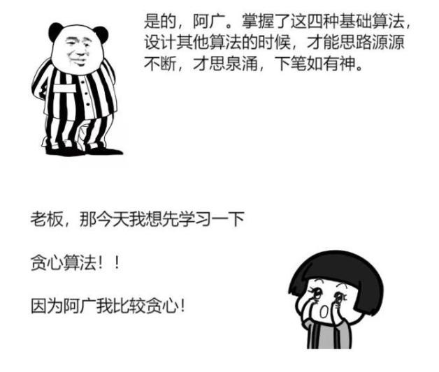
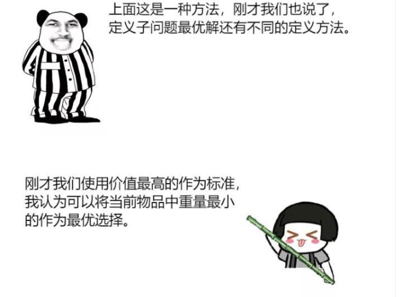
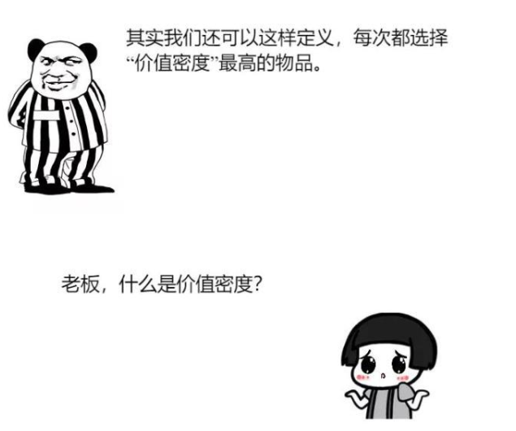
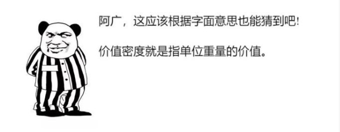
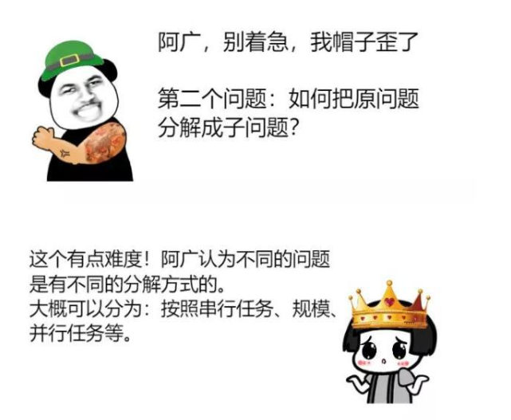
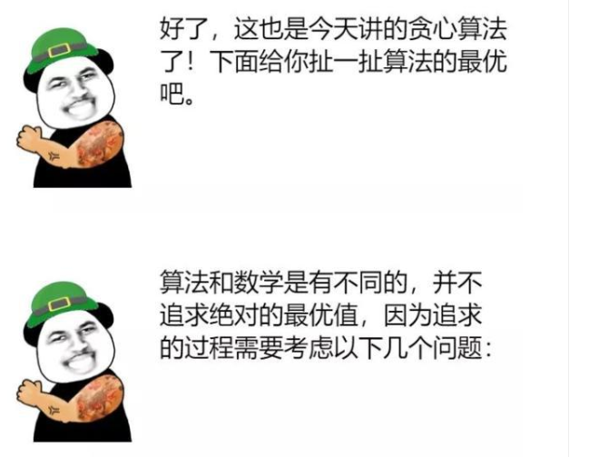

# ES6 Set 与 Map

Set 和 Map 主要的应用场景在于数组去重和数据存储
也可以说 Set 是一种叫做集合的数据结构，Map 是一种叫做字典的数据结构
这里提到了数据结构就先来了解一下：

#### 集合

-   集合是由一组无序且唯一(即不能重复)的项组成的，可以想象成集合是一个既没有重复元素，也没有顺序概念的数组
-   ES6 提供了新的数据结构 Set。它类似于数组，但是成员的值都是唯一的，没有重复的值
-   Set 本身是一个构造函数，用来生成 Set 数据结构
-   这里说的 Set 其实就是我们所要讲到的集合，先来看下基础用法

    ```js
    const s = new Set();
    [2, 3, 5, 4, 5, 2, 2].forEach(x => s.add(x));
    for (let i of s) {
        console.log(i); // 2 3 5 4
    }
    // 去除数组的重复成员
    let array = [1, 2, 1, 4, 5, 3];
    [...new Set(array)]; // [1, 2, 4, 5, 3]
    ```

#### Set 实例的属性和方法

1. Set 的属性：

-   size：返回集合所包含元素的数量

2. Set 的方法：

操作方法

-   add(value)：向集合添加一个新的项
-   delete(value)：从集合中移除一个值
-   has(value)：如果值在集合中存在，返回 true,否则 false
-   clear(): 移除集合里所有的项

-   #### 创建一个集合

    ```js
    function Set(arr = []) {
        // 可以传入数组
        let items = {};
        this.size = 0; // 记录集合中成员的数量
    }
    ```

    这里用{}对象来表示集合，也是因为对象不允许一个键指向两个不同的属性，保证了集合里的元素都是唯一的
    接下来，就需要按照 ES6 中 Set 类的实现，添加一些集合的操作方法了

1. has 方法

    首先要实现的是 has 方法，下面来看一下它的实现

    ```js
    function Set() {
        let items = {};
        this.size = 0;

        // has(val)方法
        this.has = function(val) {
            // 对象都有 hasOwnProperty 方法，判断是否拥有特定属性
            return items.hasOwnProperty(val);
        };
    }
    ```

2. add 方法

    接下来要实现 add 方法

    ```js
    // add(val)方法
    this.add = function(val) {
        if (!this.has(val)) {
            items[val] = val;
            this.size++; // 累加集合成员数量
            return true;
        }
        return false;
    };
    ```

    对于给定的 val，可以检测是否存在于集合中
    如果不存在，就添加到集合中，返回 true
    如果存在，就直接返回 false，不做任何操作

3. delete 和 clear 方法

    ```js
    // delete(val)方法
    this.delete = function(val) {
        if (this.has(val)) {
            delete items[val]; // 将 items 对象上的属性删掉
            this.size--;
            return true;
        }
        return false;
    };
    // clear 方法
    this.clear = function() {
        items = {}; // 直接将集合赋一个空对象即可
        this.size = 0;
    };
    ```

    在 delete 方法中，判断 val 是否存在于集合中，如果存在就直接从集合中删掉，返回 true


    遍历方法

-   keys()：返回一个包含集合中所有键的数组
-   values()：返回一个包含集合中所有值的数组
-   entries：返回一个包含集合中所有键值对的数组(感觉没什么用就不实现了)
-   forEach()：用于对集合成员执行某种操作，没有返回值

由于 Set 结构没有键名，只有键值（或者说键名和键值是同一个值），所以 keys 方法和 values 方法的行为完全一致。

    ```js
    const set = new Set(['a', 'b', 'c'])
    for (let item of set.keys()) {
    console.log(item)
    }
    // a
    // b
    // c

    for (let item of set.values()) {
    console.log(item)
    }
    // a
    // b
    // c

    for (let item of set.entries()) {
    console.log(item)
    }
    // ["a", "a"]
    // ["b", "b"]
    // ["c", "c"]

    // 直接遍历set实例，等同于遍历set实例的values方法
    for (let i of set) {
    console.log(i)
    }
    // a
    // b
    // c

    set.forEach((value, key) => console.log(key + ' : ' + value))

    // a: a
    // b: b
    // c: c
    ```

Set 对象作用

1. 合并两个 set 对象

    ```js
    let a = new Set([1, 2, 3]);
    let b = new Set([4, 3, 2]);
    let union = new Set([...a, ...b]); // {1, 2, 3, 4}
    ```

2. 交集

    ```js
    let a = new Set([1, 2, 3]);
    let b = new Set([4, 3, 2]);
    let intersect = new Set([...a].filter(x => b.has(x))); // {2, 3} 利用数组的 filter 方法
    ```

3. 差集

    ```js
    let a = new Set([1, 2, 3]);
    let b = new Set([4, 3, 2]);
    let difference = new Set([...a].filter(x => !b.has(x))); // {1}
    ```

    ```js
    //var的使用
    var a = 'a';
    var a = 'b';
    console.log(a); //b
    //let的使用；
    let a = 'a';
    let a = 'b'; //error
    ```

-   #### Map

Map 对象保存键值对。任何值(对象或者原始值) 都可以作为一个键或一个值。构造函数 Map 可以接受一个数组作为参数。

-   Map 和 Object 的区别

    Map 中的键值是有序的（FIFO 原则），而添加到对象中的键则不是。
    Map 的键值对个数可以从 size 属性获取，而 Object 的键值对个数只能手动计算。
    Object 都有自己的原型，原型链上的键名有可能和你自己在对象上的设置的键名产生冲突。

1. Map 对象的属性

    size：返回 Map 对象中所包含的键值对个数

2. Map 对象的方法

-   set(key, val): 向 Map 中添加新元素
-   get(key): 通过键值查找特定的数值并返回
-   has(key): 判断 Map 对象中是否有 Key 所对应的值，有返回 true,否则返回 false
-   delete(key): 通过键值从 Map 中移除对应的数据
-   clear(): 将这个 Map 中的所有元素删除

    ```js
    const m1 = new Map([
        ['a', 111],
        ['b', 222]
    ]);
    console.log(m1); // {"a" => 111, "b" => 222}
    m1.get('a'); // 111

    const m2 = new Map([['c', 3]]);
    const m3 = new Map(m2);
    m3.get('c'); // 3
    m3.has('c'); // true
    m3.set('d', 555);
    m3.get('d'); // 555
    ```

3. Map 遍历的方法

-   keys()：返回键名的遍历器
-   values()：返回键值的遍历器
-   entries()：返回键值对的遍历器
-   forEach()：使用回调函数遍历每个成员

    ```js
    const map = new Map([
        ['a', 1],
        ['b', 2]
    ]);

    for (let key of map.keys()) {
        console.log(key);
    }
    // "a"
    // "b"

    for (let value of map.values()) {
        console.log(value);
    }
    // 1
    // 2

    for (let item of map.entries()) {
        console.log(item);
    }
    // ["a", 1]
    // ["b", 2]

    // 或者
    for (let [key, value] of map.entries()) {
        console.log(key, value);
    }
    // "a" 1
    // "b" 2

    // for...of...遍历map等同于使用map.entries()

    for (let [key, value] of map) {
        console.log(key, value);
    }
    // "a" 1
    // "b" 2
    ```

-   ### map 与其他数据结构的互相转换

-   Map 与对象的互换

    ```js
    const obj = {};
    const map = new Map(['a', 111], ['b', 222]);
    for (let [key, value] of map) {
        obj[key] = value;
    }
    console.log(obj); // {a:111, b: 222}
    ```

    后面的东西有点多，还没看完，理清楚，所以就留给后面的分享者慢慢讲

    #### 插个题外话，讲个贪心算法




-   假设一个问题比较复杂，暂时找不到全局最优解，那么我们可以考虑把原问题拆成几个小问题（分而治之思想），分别求每个小问题的最优解，再把这些“局部最优解”叠起来，就“当作”整个问题的最优解了。


贪心算法的三步走！

-   第一步

明确到底什么是最优解？明确下来之后用小本本记下来！

-   第二步

明确什么是子问题的最优解？再用小本本记下来！

-   第三步

分别求出子问题的最优解再堆叠出全局最优解？这步不用记！
就是这么简单！

举个栗子：

-   0-1 背包问题

有一个背包，最多能承载 150 斤的重量，现在有 7 个物品，重量分别为[35, 30, 60, 50, 40, 10, 25]，它们的价值分别为[10, 40, 30, 50, 35, 40, 30]，如果是你的话，应该如何选择才能使得我们的背包背走最多价值的物品？

-   #### 贪心算法三步走

1. 明确最优解


2. 子问题最优解
   
   

3. 分别求出子问题的最优解再堆叠出全局最优解？

按照制订的规则（价值）进行计算，顺序是：4 2 6 5 。

最终的总重量是：130。

最终的总价值是：165。


按照制订的规则（重量）进行计算，顺序是：6 7 2 1 5 。

最终的总重量是：140。

最终的总价值是：155。

可以看到，重量优先是没有价值优先的策略更好。



按照制订的规则（单位密度）进行计算，顺序是：6 2 7 4 1。

最终的总重量是：150。

最终的总价值是：170。

可以看到，单位密度这个策略比之前的价值策略和重量策略都要好。


贪心算法三个核心问题！！！


是的，阿广，你说的基本意思正确！

下面我总结一下使用贪心算法的前提：

1、原问题复杂度过高；

2、求全局最优解的数学模型难以建立；

3、求全局最优解的计算量过大；

4、没有太大必要一定要求出全局最优解，“比较优”就可以。

那么几乎 99.99999999999%就要使用贪心算法的思想来解决问题。


-   按串行任务分

时间串行的任务，按子任务来分解，即每一步都是在前一步的基础上再选择当前的最优解。

-   按规模递减分

规模较大的复杂问题，可以借助递归思想（见第 2 课），分解成一个规模小一点点的问题，循环解决，当最后一步的求解完成后就得到了所谓的“全局最优解”。

-   按并行任务分

这种问题的任务不分先后，可能是并行的，可以分别求解后，再按一定的规则（比如某种配比公式）将其组合后得到最终解。




-   成本

耗费多少资源，花掉多少编程时间。

-   速度

计算量是否过大，计算速度能否满足要求。

-   价值

得到了最优解与次优解是否真的有那么大的差别，还是说差别可以忽略。


算法可以贪心

因为算法贪心可以解决

生活中的大部分问题

人啊

千万不要贪心

因为人贪心可以带来

生活中的大部分困难

侈则多欲

君子多欲则恋慕富贵

枉道速祸

分享：`丁紫伊`
