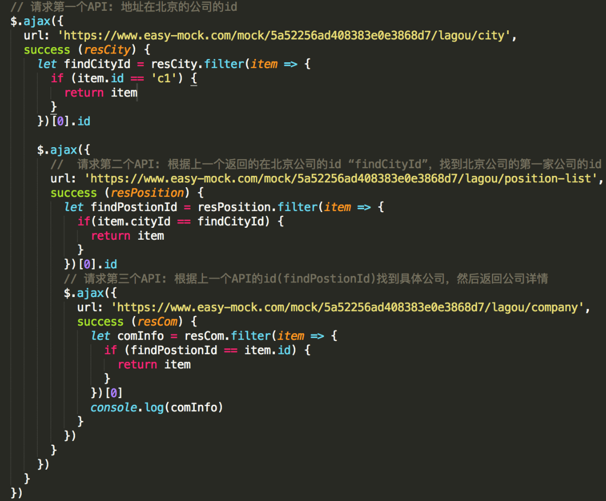

# Promise 对象

从语法上说，Promise 是一个对象，Promise 对象代表了未来将要发生的事件，用来传递异步操作的消息。

### 特点

对象的状态不受外界影响。Promise 对象代表一个异步操作，有三种状态：

- pendding 初始状态

- fulfilled 操作成功完成

- rejected 操作失败

当 promise 状态发生改变，就会触发 then()里的响应函数处理后续步骤，promise 状态一经改变，不会再变。

### Promise 优缺点



- 优点：可以将异步操作以同步操作的流程表达出来，避免了层层嵌套的回调函数。

- 缺点：首先，无法取消 Promise，一旦新建它就会立即执行，无法中途取消。其次，当处于 Pending 状态时，无法得知目前进展到哪一个阶段（刚刚开始还是即将完成）。

```javascript
function getPoster(url, name) {
  const promise = new Promise(function(resolve, reject) {
    $.ajax({
      url: url,
      success(res) {
        let value = res.filter(item => {
          if (item.id == name) return;
        })[0].id;
        resolve(value);
      }
    });
  });
  return promise;
}
let url1 = 'https://enxcx.rd.duia.com/rm/mine';
let url2 = 'https://enxcx.rd.duia.com/rm/punch-card-log';
let url3 = 'https://mp.api.test.duia.com/commodity/commodityBase';

getPoster(url1, 'c1')
  .then(res => {
    return getPoster(url2, res);
  })
  .then(res => {
    return getPoster(url3, res);
  })
  .then(res => {
    console.log(res);
  });
```

## Promise 实例

（1）简单的 promise 实例

```javascript
let p = new Promise(resolve => {
  console.log('Promise内部');
  setTimeout(() => {
    resolve('hello hello');
  }, 2000);
});
p.then(res => {
  console.log(res, 'then函数');
});
```

（2）链式调用，顺序执行

```javascript
p.then(val => {
  console.log(val, '上一个promise对象的值'); //  参数val = 'hello'
  return new Promise(resolve => {
    setTimeout(() => {
      resolve('world world');
    }, 2000);
  });
}).then(val => {
  console.log(val, '上一个.then()返回的promise对象的值'); // 参数val = 'world'
});
```

### .then()

1、接收两个函数作为参数，分别代表 fulfilled（成功）和 rejected（失败）

2、.then()返回一个新的 Promise 实例，所以它可以链式调用

3、当前面的 Promise 状态改变时，.then()根据其最终状态，选择特定的状态响应函数执行

4、状态响应函数可以返回新的 promise，或其他值，不返回值也可以我们可以认为它返回了一个 null；

5、如果返回新的 promise，那么下一级.then()会在新的 promise 状态改变之后执行

### 假如在.then()的函数里面不返回新的 promise，会怎样？

```javascript
p.then(val => {
  console.log(val, 'first');
  return new Promise(resolve => {
    setTimeout(() => {
      resolve('baby baby');
    }, 2000);
  });
})
  .then(val => {
    console.log(val, 'next');
  })
  .then(val => {
    console.log(val, 'after');
  })
  .then(val => {
    console.log('last');
  });
```

.then()如果返回其他任何值，则会立即执行下一级.then()

### 错误处理。

（1）第一种错误处理

```javascript
let p1 = new Promise((resolve, reject) => {
  setTimeout(() => {
    reject('bye bye');
  }, 2000);
});

p1.then(
  val => {
    console.log(val);
  },
  err => {
    console.log('error:' + err);
  }
);
```

(2)第二种错误处理

```javascript
let p2 = new Promise(resolve => {
  setTimeout(() => {
    resolve('123345');
  }, 2000);
});
p2.then(val => {
  console.log('first');
  throw new Error('bye bye');
})
  .catch(err => {
    console.log('error:' + err);
  })
  .then(val => {
    console.log('last');
  })
  .then(val => {
    console.log('再次抛出异常');
    throw new Error('bye bye');
  })
  .then(val => {
    console.log('11111');
  })
  .then(val => {
    console.log('2222222');
  })
  .catch(err => {
    console.log(err);
  });
```

推荐使用第二种方式，更加清晰好读，并且可以捕获前面所有的错误（可以捕获 N 个 then 回调错误）,这个过程可以发现 catch 也会返回一个 promise 实例，并且是 resolved 状态，而抛出错误变
为 rejected 状态，所以绕过两个 then 直接跑到最下面的 catch。

## Promise.all()批量执行

Promise.all([p, p1, p2])用于将多个 promise 实例，包装成一个新的 Promise 实例，返回的实例就是普通的 promise，它接收一个数组作为参数，数组里可以是 Promise 对象，也可以是别的值，只
有 Promise 会等待状态改变，当所有的子 Promise 都完成，该 Promise 完成，返回值是全部值得数组，有任何一个失败，该 Promise 失败，返回值是第一个失败的子 Promise 结果。

```javascript
Promise.all([p, p1, p2]).then(val => {
  console.log(val);
});
```

p1 返回失败状态，该 Promise 抛出异常，失败

## Promise.race()

Promise.race() 类似于 Promise.all() ，区别在于它有任意一个完成就算完成

```javascript
Promise.all([p1, p, p2]).then(val => {
  console.log(val);
});
```

# Generator 函数

Generator 函数是 ES6 引入的新型函数，用于异步编程

### 函数组成

- 一是在 function 后面，函数名之前有个 \*

- 函数内部有 yield 表达式。

其中 \* 用来表示函数为 Generator 函数，yield 用来定义函数内部的状态。

```javascript
function* g() {
  yield 'a';
  yield 'b';
  yield 'c';
  return 'ending';
}
g(); // 返回一个对象
```

### 执行机制

g()并不会执行 g 函数，返回的也不是函数运行结果，而是一个指向内部状态的指针对象，也就是迭代器对象（Iterator Object）。调用遍历器对象 Iterator 的 next 方法，指针就会从函数头部或者上一次停下来的地方开始执行。

```javascript
let gen = g();
gen.next(); // 返回Object {value: "a", done: false}
```

gen.next()返回一个非常非常简单的对象{value: "a", done: false}，'a'就是 g 函数执行到第一个 yield 语句之后得到的值，false 表示 g 函数还没有执行完，只是在这暂停。

### 迭代器之间互不干扰

```javascript
function* g() {
  let o = 1;
  yield o++;
  yield o++;
  yield o++;
}
let gen = g();
console.log(gen.next()); // 1
let xxx = g();
console.log(gen.next()); // 2
console.log(xxx.next()); // 1
console.log(gen.next()); // 3
```

可以看出，Generator 函数的特点就是：

- 1、分段执行，可以暂停

- 2、可以控制阶段和每个阶段的返回值

- 3、可以知道是否执行到结尾

## yeild 语句

迭代器对象的 next 方法的运行逻辑如下。

（1）遇到 yield 语句，就暂停执行后面的操作，并将紧跟在 yield 后面的那个表达式的值，作为返回的对象的 value 属性值。

（2）下一次调用 next 方法时，再继续往下执行，直到遇到下一个 yield 语句。

（3）如果没有再遇到新的 yield 语句，就一直运行到函数结束，直到 return 语句为止，并将 return 语句后面的表达式的值，作为返回的对象的 value 属性值。

（4）如果该函数没有 return 语句，则返回的对象的 value 属性值为 undefined。

## next 方法参数

next 方法参数的作用，是为上一个 yield 语句赋值。由于 yield 永远返回 undefined，这时候，如果有了 next 方法的参数，yield 就被赋了值。

比如下例，原本 a 变量的值是 0，但是有了 next 的参数，a 变量现在等于 next 的参数，也就是 11。

next 方法的参数每次覆盖的一定是 undefined。next 在没有参数的时候，函数体里面写 let xx = yield oo;是没意义的，因为 xx 一定是 undefined。

```javascript
function* g() {
  let o = 1;
  let a = yield o++;
  console.log('a = ' + a);
  let b = yield a * o++;
  let c = yield b * o++;
  let d = yield c * o++;
}
let gen = g();

console.log(gen.next()); //1
console.log('------');
console.log(gen.next(11)); //22
console.log(gen.next()); //NaN
console.log(gen.next(6)); //24
```

提问：第一个.next()可以有参数吗？

答：设这样的参数没任何意义，因为第一个.next()的前面没有 yield 语句。

## for...of 循环

for...of 循环可以自动遍历 Generator 函数时生成的 Iterator 对象，且此时不再需要调用 next 方法。

```javascript
function* foo() {
  yield 1;
  yield 2;
  yield 3;
  yield 4;
  yield 5;
  return 6;
}

let a = foo(); //其中foo()是迭代器对象，可以把它赋值给变量，然后遍历这个变量。

for (let v of a) {
  console.log(v);
}
// 1 2 3 4 5
```

上面代码使用 for...of 循环，依次显示 5 个 yield 语句的值。这里需要注意，一旦 next 方法的返回对象的 done 属性为 true，for...of 循环就会中止，且不包含该返回对象，所以上面代码的 return 语句返回的 6，不包括在 for...of 循环之中。

## 如何在 Generater 函数内部，调用另一个 Generator 函数？

```javascript
function* foo() {
  yield 'a';
  yield 'b';
}
function* goo() {
  yield 'hh';
  yield 'mm';
  return 'ss';
}
function* bar() {
  yield 'x';
  foo();
  yield 'y';
}

for (let v of bar()) {
  console.log(v);
}
// "x"
// "y"
```

直接在函数内部调用是无效的，并没有遍历出'a'和'b'。

```javascript
function* foo() {
  yield 'hh';
  yield 'mm';
  return;
}

function* goo() {
  yield 2;
  yield 3;
  return 'foo';
}

function* bar() {
  yield 1;
  let v = yield* goo();
  console.log('v: ' + v);
  yield 4;
  for (let i of goo()) {
    console.log(i);
  }
}

let it = bar();

it.next();
// {value: 1, done: false}
it.next();
// {value: 2, done: false}
it.next();
// {value: 3, done: false}
it.next();
// "v: foo"
// {value: 4, done: false}
it.next();
// {value: undefined, done: true}
```

yield* 语句的作用，就是遍历一遍 foo()函数的迭代器对象。foo()函数（return 语句没有返回值时）是 for...of 的一种简写形式，完全可以用 for...of 替代 yield*。反之，由于 go0()函数的 return 语句，不会被 yield* 遍历，所以需要用 let value = yield* iterator 的形式获取 return 语句的值。

在第四次调用 next 方法的时候，屏幕上会有输出，这是因为函数 foo 的 return 语句，向函数 bar 提供了返回值。

## 实例

异步流控:上一个工序完成后，才能继续下一个工序

```javascript
//准备
function prepare(sucess) {
  setTimeout(function() {
    console.log('prepare chicken');
    sucess();
  }, 500);
}

//炒鸡
function fired(sucess) {
  setTimeout(function() {
    console.log('fired chicken');
    sucess();
  }, 500);
}
//炖鸡
function stewed(sucess) {
  setTimeout(function() {
    console.log('stewed chicken');
    sucess();
  }, 500);
}
//上料
function sdd(sucess) {
  setTimeout(function() {
    console.log('sdd chicken');
    sucess();
  }, 500);
}
//上菜
function serve(sucess) {
  setTimeout(function() {
    console.log('serve chicken');
    sucess();
  }, 500);
}

//流程控制
function run(fn) {
  const gen = fn();
  function next() {
    const result = gen.next();
    if (result.done) return; //结束
    // result.value就是yield返回的值，是各个工序的函数
    result.value(next); //next作为入参，即本工序成功后，执行下一工序
  }
  next();
}
//工序
function* task() {
  yield prepare;
  yield fired;
  yield stewed;
  yield sdd;
  yield serve;
}
run(task); //开始执行
```
