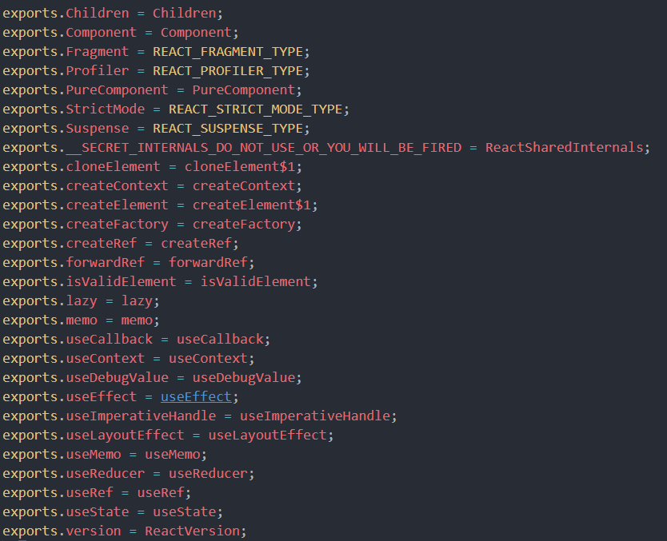

## React源码剖析(一)

> 第一次正式研究一个框架的源码，咱们就先易后难、由浅至深,从最基础的API开始入手。废话少说，开局先来一张图!



通过查看源码可以看出react暴露出来的API大致有这些，下面就来逐一了解这些API的底层。

#### Children
  
```javascript
    // 抛出的Children,分别有map、forEach、count、toArray、only五个方法
    var Children = {
      map: mapChildren,
      forEach: forEachChildren,
      count: countChildren,
      toArray: toArray,
      only: onlyChild
    };
```
##### only
用来验证 children 是否只有一个子节点（一个 React 元素），如果有则返回它，否则此方法会抛出错误。

```javascript
    //判断是否为React Element(这也是个暴露出来的API)
    function isValidElement(object) {
      //var hasSymbol = typeof Symbol === 'function' && Symbol.for;
      //var REACT_ELEMENT_TYPE = hasSymbol ? Symbol.for('react.element') : 0xeac7;
      return typeof object === 'object' && object !== null && object.$$typeof === REACT_ELEMENT_TYPE;
    }

    function onlyChild(children) {
    //判断不是一个React Element则抛出错误
      if (!isValidElement(children)) {
        {
          throw Error( "React.Children.only expected to receive a single React element child." );
        }
      }
      return children; 
    }

```
#### count
返回传入Children中的组件数量

```javascript
    function countChildren(children) {
      return traverseAllChildren(children, function () {
        return null;
      }, null);
    }
    function traverseAllChildren(children, callback, traverseContext) {
          //如果children不存在，则返回0
          if (children == null) {
            return 0;
          }
          return traverseAllChildrenImpl(children, '', callback, traverseContext);
    }
    //递归遍历
    function traverseAllChildrenImpl(children, nameSoFar, callback, traverseContext) {
      var type = typeof children;
      if (type === 'undefined' || type === 'boolean') {
        children = null;
      }

      var invokeCallback = false;
      if (children === null) {
        invokeCallback = true;
      } else {
        switch (type) {
          case 'string':
          case 'number':
            invokeCallback = true;
            break;
    
          case 'object':
            switch (children.$$typeof) {
              case REACT_ELEMENT_TYPE:
              case REACT_PORTAL_TYPE:
                invokeCallback = true;
            }
    
        }
      }
    
      if (invokeCallback) {
        callback(traverseContext, children, // If it's the only child, treat the name as if it was wrapped in an array
        // so that it's consistent if the number of children grows.
        nameSoFar === '' ? SEPARATOR + getComponentKey(children, 0) : nameSoFar);
        return 1;
      }
    
      var child;
      var nextName;
      var subtreeCount = 0; // Count of children found in the current subtree.
    
      var nextNamePrefix = nameSoFar === '' ? SEPARATOR : nameSoFar + SUBSEPARATOR;
    
      if (Array.isArray(children)) {
        //传进来的children为一个数组的时候，遍历数组并且递归操作数组每一项
        for (var i = 0; i < children.length; i++) {
          child = children[i];
          nextName = nextNamePrefix + getComponentKey(child, i);
          // 叠加结果
          subtreeCount += traverseAllChildrenImpl(child, nextName, callback, traverseContext);
        }
      } else {
        var iteratorFn = getIteratorFn(children);
        if (typeof iteratorFn === 'function') {
    
          {
            // Warn about using Maps as children(实验性用法，可能废弃，所以这里给了警告)
            if (iteratorFn === children.entries) {
              if (!didWarnAboutMaps) {
                warn('Using Maps as children is deprecated and will be removed in ' + 'a future major release. Consider converting children to ' + 'an array of keyed ReactElements instead.');
              }
    
              didWarnAboutMaps = true;
            }
          }
    
          var iterator = iteratorFn.call(children);
          var step;
          var ii = 0;
          //和上面遍历数组同理，不过换成了iterator
          while (!(step = iterator.next()).done) {
            child = step.value;
            nextName = nextNamePrefix + getComponentKey(child, ii++);
            subtreeCount += traverseAllChildrenImpl(child, nextName, callback, traverseContext);
          }
        } else if (type === 'object') {
          //为object则抛出错误
          var addendum = '';
          {
            addendum = ' If you meant to render a collection of children, use an array ' + 'instead.' + ReactDebugCurrentFrame.getStackAddendum();
          }
          var childrenString = '' + children;
          {
            {
              throw Error( "Objects are not valid as a React child (found: " + (childrenString === '[object Object]' ? 'object with keys {' + Object.keys(children).join(', ') + '}' : childrenString) + ")." + addendum );
            }
          }
        }
      }
    
      return subtreeCount; //最后返回结果
    }
```
#### toArray
将children这个复杂的数据结构以数组的方式扁平展开并返回，并为每个子节点分配一个 key
```javascript
   function toArray(children) {
     var result = [];
     mapIntoWithKeyPrefixInternal(children, result, null, function (child) {
       return child;
     });
     return result;
   }
```
#### map&&forEach
都是用来遍历children的，区别和原生数组的forEach、map一样
```javascript
    function mapChildren(children, func, context) {
      if (children == null) {
        return children;
      }
      // 定义一个空数组,经过mapIntoWithKeyPrefixInternal操作后再返回
      var result = [];
      mapIntoWithKeyPrefixInternal(children, result, null, func, context);
      return result; 
    }
    // 扁平展开数组的操作
    function mapIntoWithKeyPrefixInternal(children, array, prefix, func, context) {
      var escapedPrefix = '';
      if (prefix != null) {
        escapedPrefix = escapeUserProvidedKey(prefix) + '/';
      }
      // 就是从pool里面找一个对象，releaseTraverseContext会把当前的context对象清空然后放回到pool中。
      var traverseContext = getPooledTraverseContext(array, escapedPrefix, func, context);
      traverseAllChildren(children, mapSingleChildIntoContext, traverseContext);
      releaseTraverseContext(traverseContext); //最后又把从Pool里面拿出来的对象放回去
    }
    var POOL_SIZE = 10;
    var traverseContextPool = []; //定义一个专门存放上下文，类似中转站
    // 在pool里面获取对象
    function getPooledTraverseContext(mapResult, keyPrefix, mapFunction, mapContext) {
      if (traverseContextPool.length) {
        //当pool里面有存入对象，直接获取最后一项
        var traverseContext = traverseContextPool.pop();
        traverseContext.result = mapResult;
        traverseContext.keyPrefix = keyPrefix;
        traverseContext.func = mapFunction;
        traverseContext.context = mapContext;
        traverseContext.count = 0;
        return traverseContext;
      } else {
        return {
          result: mapResult,
          keyPrefix: keyPrefix,
          func: mapFunction,
          context: mapContext,
          count: 0
        };
      }
    }
    function mapSingleChildIntoContext(bookKeeping, child, childKey) {
      var result = bookKeeping.result,
          keyPrefix = bookKeeping.keyPrefix,
          func = bookKeeping.func,
          context = bookKeeping.context;
      var mappedChild = func.call(context, child, bookKeeping.count++); //这里就是外部我们调用map方法传入的回调函数
      // 如果遍历到数组则重复执行
      if (Array.isArray(mappedChild)) {
        mapIntoWithKeyPrefixInternal(mappedChild, result, childKey, function (c) {
          return c;
        });
      } else if (mappedChild != null) {
        if (isValidElement(mappedChild)) {
          mappedChild = cloneAndReplaceKey(mappedChild, // Keep both the (mapped) and old keys if they differ, just as
          // traverseAllChildren used to do for objects as children
          keyPrefix + (mappedChild.key && (!child || child.key !== mappedChild.key) ? escapeUserProvidedKey(mappedChild.key) + '/' : '') + childKey);
        }
        result.push(mappedChild); //往结果中添加每次遍历的对象
      }
    }
```
> 这里的核心操作就是手动创建一个长度为10的数组Pool,如果map之后的节点还是一个数组，那么再次进入mapIntoWithKeyPrefixInternal，那么这个时候我们就会再次从pool里面去context了，而pool的意义大概也就是在这里了，如果循环嵌套多了，可以减少很多对象创建和gc的损耗。
### 参考
- [react源码阅读-React.Children](https://www.jianshu.com/p/c39a912bc77a)

`分享：李超凡`