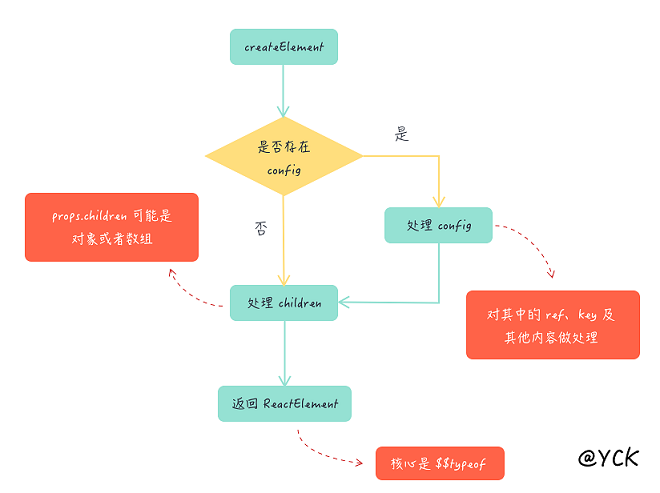

## React 源码剖析(二)

### createElement 
大家在写 React 代码的时候肯定写过 JSX，但是为什么一旦使用 JSX 就必须引入 React 呢？
这是因为我们的 JSX 代码会被 Babel 编译为 React.createElement。当我们输入 `const demo= (<div class="demo">hello</div>)`，Bable会为我们编译为
```javascript
const demo = React.createElement(
  'div',
  {
    class:'demo'
  },
  'hello'
)
```
接下来看看createElement都做了什么。




首先是对config的处理：
```javascript
// 判断是否传入配置，比如 <div className='11'></div> 中的 className 会被解析到config中
if (config != null) {
    //验证ref是否有效
    if (hasValidRef(config)) {
      ref = config.ref;
      {
        warnIfStringRefCannotBeAutoConverted(config);
      }
    }
    //验证key是否有效
    if (hasValidKey(config)) {
      key = '' + config.key;
    }
    // 赋值操作
    // self 就是为了以后正确获取 this
    
    self = config.__self === undefined ? null : config.__self;
    // source 内部有一些 filename、line number这种
    source = config.__source === undefined ? null : config.__source; 
    // 遍历 config 并把内建的几个属性（ref、key、__self、__source）剔除后丢到 props 对象中。
    for (propName in config) {
      if (hasOwnProperty.call(config, propName) && !RESERVED_PROPS.hasOwnProperty(propName)) {
        props[propName] = config[propName];
      }
    }
  } 
```
对children进行处理
```javascript
if (childrenLength === 1) {
    props.children = children;  
  } else if (childrenLength > 1) { //长度大于1，代表有多个children， props.children 是一个数组
    var childArray = Array(childrenLength);

    for (var i = 0; i < childrenLength; i++) {
      childArray[i] = arguments[i + 2];
    }

    {
      if (Object.freeze) { 
        Object.freeze(childArray);
      }
    }

    props.children = childArray;
  }
```
> Object.freeze() 冻结一个对象。一个被冻结的对象再也不能被修改；冻结了一个对象则不能向这个对象添加新的属性，不能删除已有属性，不能修改该对象已有属性的可枚举性、可配置性、可写性，以及不能修改已有属性的值。此外，冻结一个对象后该对象的原型也不能被修改

最后，返回一个ReactElement对象

```javascript
// 判断是否支持 Symbol，如果支持就使用 Symbol 来作为类型的唯一标识，否则直接通过序列数来表示
var hasSymbol = typeof Symbol === 'function' && Symbol.for;
var REACT_ELEMENT_TYPE = hasSymbol ? Symbol.for('react.element') : 0xeac7;
//这是一个创建reactElement的工厂方法
var ReactElement = function (type, key, ref, self, source, owner, props) {
  var element = {
    
    $$typeof: REACT_ELEMENT_TYPE,// react元素标识
    // Built-in properties that belong on the element
    type: type,
    key: key,//DOM结构标识，提升update性能
    ref: ref,
    props: props,//子结构相关信息(有则增加children字段/没有为空)和组件属性(如style)
    // Record the component responsible for creating this element.
    _owner: owner
  };

  {
    //验证标志当前是可变的。我们把它放在一个外部后备存储器上，这样我们就可以冻结整个对象。
    //一旦它们在常用的开发环境中实现，就可以用WeakMap来代替它们。
    element._store = {}; 
    //为了使比较ReactElements更容易进行测试，我们将验证标志设为不可枚举

    Object.defineProperty(element._store, 'validated', {
      configurable: false,
      enumerable: false,
      writable: true,
      value: false
    }); // self and source are DEV only properties.

    Object.defineProperty(element, '_self', {
      configurable: false,
      enumerable: false,
      writable: false,
      value: self
    }); // Two elements created in two different places should be considered
    // equal for testing purposes and therefore we hide it from enumeration.

    Object.defineProperty(element, '_source', {
      configurable: false,
      enumerable: false,
      writable: false,
      value: source
    });

    if (Object.freeze) {
      Object.freeze(element.props);
      Object.freeze(element);
    }
  }

  return element;
};
```
>Symbol.for(key) 方法会根据给定的键 key，来从运行时的 symbol 注册表中找到对应的 symbol，如果找到了，则返回它，否则，新建一个与该键关联的 symbol，并放入全局 symbol 注册表中。

### Component 及 PureComponent
```javascript
var emptyObject = {};
{
  Object.freeze(emptyObject);
}
function Component(props, context, updater) {
  this.props = props;
  this.context = context; // If a component has string refs, we will assign a different object later.

  this.refs = emptyObject; // We initialize the default updater but the real one gets injected by the renderer.

  this.updater = updater || ReactNoopUpdateQueue; //ReactNoopUpdateQueue主要是用于报警告
}

Component.prototype.isReactComponent = {};


//无法保证“this.state”会立即更新，因此调用此方法后访问“this.state”可能会返回旧值。无法保证对“setState”的调用将同步运行，因为它们最终可能被批处理在一起。您可以提供一个可选回调，当对setState的调用实际完成时将执行该回调.
Component.prototype.setState = function (partialState, callback) {
  if (!(typeof partialState === 'object' || typeof partialState === 'function' || partialState == null)) {
    {
      throw Error("setState(...): takes an object of state variables to update or a function which returns an object of state variables.");
    }
  }

  this.updater.enqueueSetState(this, partialState, callback, 'setState');
};
Component.prototype.forceUpdate = function (callback) {
  this.updater.enqueueForceUpdate(this, callback, 'forceUpdate');
};
```
setState 和 forceUpdate 都是调用了 updater 中的方法，updater 是 react-dom 中的内容，这部分放到后面再讲解。

```javascript
//以下做的都是继承功能，让 PureComponent 继承自 Component
function ComponentDummy() {}
ComponentDummy.prototype = Component.prototype;
function PureComponent(props, context, updater) {
  this.props = props;
  this.context = context; // If a component has string refs, we will assign a different object later.

  this.refs = emptyObject;
  this.updater = updater || ReactNoopUpdateQueue;
}
//函数的 prototype 属性对象上的 constructor 是不可枚举的
//给 PureComponent 重新指向构造函数之后，_assign 复制对象属性时， Component 构造函数不会覆盖 PureComponent 构造函数
var pureComponentPrototype = PureComponent.prototype = new ComponentDummy();
pureComponentPrototype.constructor = PureComponent; 

_assign(pureComponentPrototype, Component.prototype);

pureComponentPrototype.isPureReactComponent = true;
```
这两个类基本相同，唯一的区别是PureComponent的原型上多了一个标识isPureReactComponent。这是检查组件是否需要更新的一个判断，ctor就是你声明的继承自Component or PureComponent的类，他会判断你是否继承自PureComponent，如果是的话就shallowEqual比较state和props。
```javascript
if (ctor.prototype && ctor.prototype.isPureReactComponent) {
  return !shallowEqual(oldProps, newProps) || !shallowEqual(oldState, newState);
}
```
React中对比一个ClassComponent是否需要更新，只有两个地方。一是看有没有shouldComponentUpdate方法，二就是这里的PureComponent判断

## ref
```javascript
function createRef() {
  var refObject = {
    current: null
  };

  {
    Object.seal(refObject);
  }

  return refObject;
}
```
>Object.seal()通常，一个对象是可扩展的（可以添加新的属性）。密封一个对象会让这个对象变的不能添加新属性，且所有已有属性会变的不可配置。属性不可配置的效果就是属性变的不可删除，以及一个数据属性不能被重新定义成为访问器属性，或者反之。但属性的值仍然可以修改

#### forwardRef
默认情况下，不能在函数组件上使用 ref 属性，因为它们没有实例。如果要在函数组件中使用 ref，可以使用 forwardRef。
```javascript
import React from 'react'
const TargetComponent = React.forwardRef((props, ref) => (
  <input type="text" ref={ref} />
))

export default class Comp extends React.Component {
  constructor() {
    super()
    this.ref = React.createRef()
  }

  componentDidMount() {
    this.ref.current.value = 'ref get input'
  }

  render() {
    return <TargetComponent ref={this.ref} />
  }
}
```
源码解读
```javascript
function forwardRef(render) {
  {
    if (render != null && render.$$typeof === REACT_MEMO_TYPE) {
      warningWithoutStack$1(false, 'forwardRef requires a render function but received a `memo` ' + 'component. Instead of forwardRef(memo(...)), use ' + 'memo(forwardRef(...)).');
    } else if (typeof render !== 'function') {
      warningWithoutStack$1(false, 'forwardRef requires a render function but was given %s.', render === null ? 'null' : typeof render);
    } else {
      !( // Do not warn for 0 arguments because it could be due to usage of the 'arguments' object
      render.length === 0 || render.length === 2) ? warningWithoutStack$1(false, 'forwardRef render functions accept exactly two parameters: props and ref. %s', render.length === 1 ? 'Did you forget to use the ref parameter?' : 'Any additional parameter will be undefined.') : void 0;
    }

    if (render != null) {
      !(render.defaultProps == null && render.propTypes == null) ? warningWithoutStack$1(false, 'forwardRef render functions do not support propTypes or defaultProps. ' + 'Did you accidentally pass a React component?') : void 0;
    }
  }

  return {
    $$typeof: REACT_FORWARD_REF_TYPE,
    render: render
  };
}
```
返回的是一个对象，对象中有个$$typeof，切忌不能与createElement中的$$typeof弄混。

拿上述demo来说，由于通过React.forwardRef返回的是一个对象，因此TargetComponent也是一个对象，而在<TargetComponent />从jsx解析为js中，解析为React.createElement(type, config, children)中，TargetComponent只是作为type。

因此使用React.forwardRef返回的$$typeof仍然是REACT_ELEMENT_TYPE，它的type是我们拿到的对象```{
    $$typeof: REACT_FORWARD_REF_TYPE,
    render,
  };```
它里面有个$$typeof，是REACT_FORWARD_REF_TYPE

因此，我们使用React.forwardRef创建的所有的节点，它的$$typeof都是REACT_ELEMENT_TYPE

