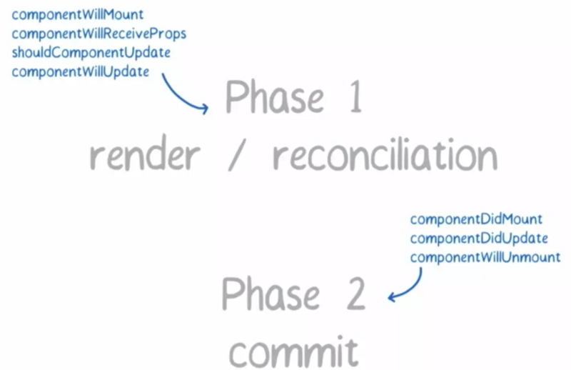
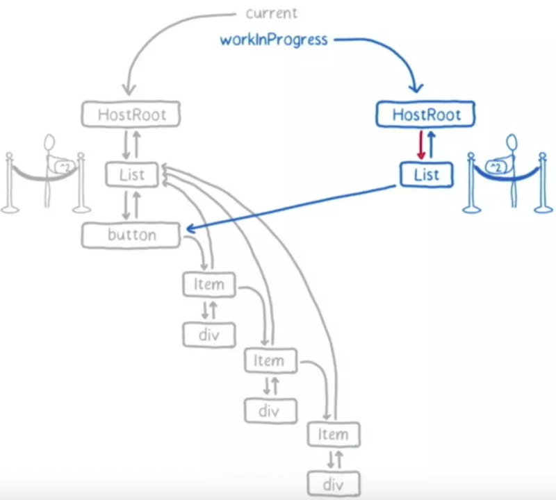

# React 源码剖析(五) 调度中心

前面有提到使用 setState，render 等方法，然后后面的一些操作就属于调度中心的了，接下来分享一下调度中心的相关内容。

首先我们先来了解一下 React16 以前和 React16 更新渲染的流程对比

- React16 以前：


- React16 Fiber Reconciler：


还记得我们之前分享性能优化的时候讲的[时间切片](https://github.com/duia-fe/weekly/blob/master/2019-share/2019-11-01/README.md)吧，Fiber 的大体思想就是利用这个时间切片把更新的流程碎片化，把一个耗时很长的任务分成很多小片。

<u>这里展示一个例子</u>

---

### 什么是 Fiber?

Fiber 是为解决长时间渲染 DOM 树造成页面卡顿以及影响用户体验而产生出来的一个东西。React Fiber 是对核心算法的一次重新实现。

它的创建和使用过程如下：

- 组件的 render 方法返回的每个 React 元素（组件）的数据都会被合并到 fiber 树中，根节点是`FiberRootNode`
- React 会为每个 React 元素创建一个 fiber 节点 （`FiberNode`）
- 与 React 元素不同，每次更新渲染过程，不会再重新创建 fiber
- 随后的更新中，React 重用 fiber 节点，并使用来自相应 React 元素的数据来更新必要的属性。
- 同时 React 会维护一个 workInProgressTree 用于计算更新（双缓冲），可以认为是一颗表示当前工作进度的树。还有一颗表示已渲染界面的旧树，React 就是一边和旧树比对，一边构建 workInProgressTree 树的。 alternate 指向旧树的同等节点。

fiber 树的结构：


---

### Fiber 的体系结构分为两个阶段：

- 阶段一 reconciliation（协调），生成 Fiber 树，得出需要更新的节点信息。这一步是一个渐进的过程，可以被打断。
- 阶段二 commit，将需要更新的节点一次过批量更新，这个过程不能被打断。

如下图：



上面阶段一可被打断，会让更高优先级的任务先执行（由上往下优先级降低）：

- immediately，与之前的版本一样，同步执行
- user blocking，用户的一些行为
- normal， 正常情况下的优先级
- low，稍微延迟执行也没关系
- idle，闲置的

构建树的过程：



---

### 第一阶段 reconciliation

##### Fiber 调度入口 scheduleUpdateOnFiber

```javascript
function scheduleUpdateOnFiber(fiber, expirationTime) {
  checkForNestedUpdates(); // 检查最大update的数量是否超过了最大值
  warnAboutRenderPhaseUpdatesInDEV(fiber);

  // 调用markUpdateTimeFromFiberToRoot，更新 fiber 节点的 expirationTime
  var root = markUpdateTimeFromFiberToRoot(fiber, expirationTime);

  if (root === null) {
    // 如果找不到root报警告
    warnAboutUpdateOnUnmountedFiberInDEV(fiber);
    return;
  }
  // 查看当前是否能被打断
  checkForInterruption(fiber, expirationTime);
  // 用来记录debug信息
  recordScheduleUpdate(); // TODO: computeExpirationForFiber also reads the priority. Pass the
  // priority as an argument to that function and this one.
  // 将优先级作为参数传递给该函数和该函数
  var priorityLevel = getCurrentPriorityLevel();

  // 如果当前是同步更新的
  if (expirationTime === Sync) {
    if (
      // Check if we're inside unbatchedUpdates
      // 检查是否在未批处理的更新内
      (executionContext & LegacyUnbatchedContext) !== NoContext &&
      // Check if we're not already rendering
      // 检查是否尚未渲染
      (executionContext & (RenderContext | CommitContext)) === NoContext
    ) {
      // Register pending interactions on the root to avoid losing traced interaction data.
      // 在根上注册待处理的交互，以避免丢失跟踪的交互数据。
      schedulePendingInteractions(root, expirationTime);
      // This is a legacy edge case. The initial mount of a ReactDOM.render-ed
      // root inside of batchedUpdates should be synchronous, but layout updates
      // should be deferred until the end of the batch.
      // 同步调用任务
      performSyncWorkOnRoot(root);
    } else {
      ensureRootIsScheduled(root);
      schedulePendingInteractions(root, expirationTime);

      if (executionContext === NoContext) {
        // Flush the synchronous work now, unless we're already working or inside
        // a batch. This is intentionally inside scheduleUpdateOnFiber instead of
        // scheduleCallbackForFiber to preserve the ability to schedule a callback
        // without immediately flushing it. We only do this for user-initiated
        // updates, to preserve historical behavior of legacy mode.
        // 执行同步更新队列
        flushSyncCallbackQueue();
      }
    }
  } else {
    ensureRootIsScheduled(root);
    schedulePendingInteractions(root, expirationTime);
  }

  if (
    (executionContext & DiscreteEventContext) !== NoContext && // Only updates at user-blocking priority or greater are considered
    // discrete, even inside a discrete event.
    (priorityLevel === UserBlockingPriority$1 || priorityLevel === ImmediatePriority)
  ) {
    // This is the result of a discrete event. Track the lowest priority
    // discrete update per root so we can flush them early, if needed.
    // 这是一个离散事件的结果。跟踪每个根的最低优先级离散更新，以便在需要时尽早刷新。
    if (rootsWithPendingDiscreteUpdates === null) {
      rootsWithPendingDiscreteUpdates = new Map([[root, expirationTime]]);
    } else {
      var lastDiscreteTime = rootsWithPendingDiscreteUpdates.get(root);

      if (lastDiscreteTime === undefined || lastDiscreteTime > expirationTime) {
        rootsWithPendingDiscreteUpdates.set(root, expirationTime);
      }
    }
  }
}
```

上面源码主要做了以下几件事

- 调用 `markUpdateTimeFromFiberToRoot` 更新 fiber 节点的 `expirationTime`
- `ensureRootIsScheduled` 重点，后面会讲这是一个
- `schedulePendingInteractions` 实际上会调用 `scheduleInteractions`
- `scheduleInteractions` 会利用 FiberRoot 的 `pendingInteractionMap` 属性和不同的 `expirationTime`，获取每次 schedule 所需的 update 任务的集合，记录它们的数量，并检测这些任务是否会出错。

---

##### ensureRootIsScheduled

上面 `scheduleUpdateOnFiber` 方法中，不管是同步还是异步都会调用这个 `ensureRootIsScheduled` 方法

```javascript
//每一个root都有一个唯一的调度任务，如果已经存在，我们要确保到期时间与下一级别任务的相同，每一次更新都会调用这个方法
function ensureRootIsScheduled(root) {
  var lastExpiredTime = root.lastExpiredTime;

  // 已经过期任务，需要同步
  if (lastExpiredTime !== NoWork) {
    // Special case: 过期的工作应同步刷新.
    root.callbackExpirationTime = Sync;
    root.callbackPriority = ImmediatePriority;
    root.callbackNode = scheduleSyncCallback(performSyncWorkOnRoot.bind(null, root));
    return;
  }

  var expirationTime = getNextRootExpirationTimeToWorkOn(root);
  var existingCallbackNode = root.callbackNode;
  // 说明接下来没有可调度的任务
  if (expirationTime === NoWork) {
    // There's nothing to work on.
    if (existingCallbackNode !== null) {
      root.callbackNode = null;
      root.callbackExpirationTime = NoWork;
      root.callbackPriority = NoPriority;
    }

    return;
  } // TODO: If this is an update, we already read the current time. Pass the
  // time as an argument.

  var currentTime = requestCurrentTimeForUpdate();
  // 根据过去时间和当前时间计算出任务优先级
  var priorityLevel = inferPriorityFromExpirationTime(currentTime, expirationTime);
  // If there's an existing render task, confirm it has the correct priority and expiration time. Otherwise, we'll cancel it and schedule a new one.
  // 如果存在一个渲染任务，必须有相同的到期时间，确认优先级如果当前任务的优先级高就取消之前的任务安排一个新的任务
  if (existingCallbackNode !== null) {
    var existingCallbackPriority = root.callbackPriority;
    var existingCallbackExpirationTime = root.callbackExpirationTime;

    if (
      // Callback must have the exact same expiration time.
      existingCallbackExpirationTime === expirationTime && // Callback must have greater or equal priority.
      existingCallbackPriority >= priorityLevel
    ) {
      // Existing callback is sufficient.
      return;
    } // Need to schedule a new task.
    // TODO: Instead of scheduling a new task, we should be able to change the
    // priority of the existing one.

    cancelCallback(existingCallbackNode);
  }
  // 取消了之前的任务需要重置为当前最新的
  root.callbackExpirationTime = expirationTime;
  root.callbackPriority = priorityLevel;
  var callbackNode;
  // 如果是同步调用
  if (expirationTime === Sync) {
    // Sync React 回调安排在一个特殊的内部队列上
    callbackNode = scheduleSyncCallback(performSyncWorkOnRoot.bind(null, root));
  } else {
    // 异步调用
    callbackNode = scheduleCallback(
      priorityLevel,
      performConcurrentWorkOnRoot.bind(null, root),
      // 根据到期时间计算任务超时。这也会影响排序，因为任务是按超时顺序处理的。
      {
        timeout: expirationTimeToMs(expirationTime) - now()
      }
    );
  }

  root.callbackNode = callbackNode;
}
```

不管是同步还是异步执行最终调用的 `performUnitOfWork` 操作，理解以为一个工作单元，这个工作单元里面分为 `beginWork` 和 `completeWork`。

---

##### beginWork

这段代码有点长就不贴出来了。在 `beginWork` 函数根据 fiber 节点（这里就是`workInProgress`）不同的 tag，调用对应的 update 方法。里面有一些方法调用 `reconcileChildren`，`reconcileChildren` 实现的就是江湖上广为流传的 Virtul DOM diff（这个留给后面的人分享吧）。也会调用第一阶段的生命周期钩子，比如：`componentWillMount`、`componentWillReceiveProps`、`componentWillMount` 等。

##### completeWork

主要是完成 `reconciliation` 阶段的扫尾工作，对 `HostComponent` 的 `props` 进行 `diff`，并标记更新。到这里第一阶段（`reconciliation`）就完了。

---

### 第二阶段 commit

后续进入 commit 阶段，然后会调用第二阶段的生命周期钩子函数，就不再介绍了。

---

### 参考文章

- [时间切片的实现和调度](https://www.cnblogs.com/zhongmeizhi/p/12971549.html)
- [react 源码学习（二）scheduleWork 任务调度](https://www.jianshu.com/p/0e7c195d6b7d)
- [React Fiber 原理介绍](https://segmentfault.com/a/1190000018250127?utm_source=tag-newest)
- [「React 16」为 Luy 实现 React Fiber 架构](https://www.jianshu.com/p/748f8c49944a)

---

**理解错误的请指点，以免误人子弟。**

> by:`虚竹`
