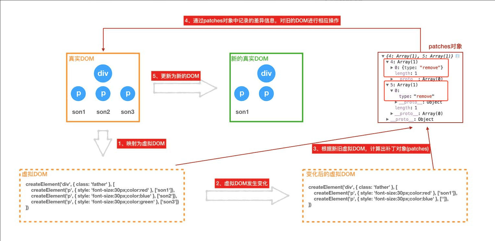

# React 源码剖析(七) diff

### 原理： diff 算法会比较前后虚拟 DOM，从而得到 patches(补丁)，然后与老 Virtual DOM 进行对比，将其应用在需要更新的地方，得到新的 Virtual DOM。



```javascript
//中心逻辑： 根据newChild类型选择不同diff函数处理
function reconcileChildFibers(returnFiber, currentFirstChild, newChild, expirationTime) {
    // 判断是否为 fragment，是的话取 fragment 的 children
    // fragment标签没有意义 只渲染children
    var isUnkeyedTopLevelFragment = typeof newChild === 'object' && newChild !== null && newChild.type === REACT_FRAGMENT_TYPE && newChild.key === null;
    if (isUnkeyedTopLevelFragment) {
        newChild = newChild.props.children;
    }
    //类型判断
    var isObject = typeof newChild === 'object' && newChild !== null;
    if (isObject) {
        // ReactElment 或者 ReactPortal
        switch (newChild.$$typeof) {
            case REACT_ELEMENT_TYPE:
                return placeSingleChild(reconcileSingleElement(returnFiber, currentFirstChild, newChild, expirationTime));
            case REACT_PORTAL_TYPE:
                return placeSingleChild(reconcileSinglePortal(returnFiber, currentFirstChild, newChild, expirationTime));
        }
    }
    // 文本
    if (typeof newChild === 'string' || typeof newChild === 'number') {
        return placeSingleChild(reconcileSingleTextNode(returnFiber, currentFirstChild, '' + newChild, expirationTime));
    }
    // 数组
    if (isArray$1(newChild)) {
        return reconcileChildrenArray(returnFiber, currentFirstChild, newChild, expirationTime);
    }
    // iterator类型
    if (getIteratorFn(newChild)) {
        return reconcileChildrenIterator(returnFiber, currentFirstChild, newChild, expirationTime);
    }
    // 如果这个newChild上面的都不符合，但又是个对象但又不是null，那么就是一个非法的定义了。就throwOnInvalidObjectType抛出错误。 抛出错误
    if (isObject) {
        throwOnInvalidObjectType(returnFiber, newChild);
    }

    {
        if (typeof newChild === 'function') {
            warnOnFunctionType();
        }
    }
    // 错误处理
    if (typeof newChild === 'undefined' && !isUnkeyedTopLevelFragment) {
        switch (returnFiber.tag) {
            case ClassComponent: {
                {
                    var instance = returnFiber.stateNode;

                    if (instance.render._isMockFunction) {
                        // We allow auto-mocks to proceed as if they're returning null.
                        break;
                    }
                }
            }

            case FunctionComponent: {
                var Component = returnFiber.type;

                {
                    {
                        throw Error(
                            (Component.displayName || Component.name || 'Component') +
                                '(...): Nothing was returned from render. This usually means a return statement is missing. Or, to render nothing, return null.'
                        );
                    }
                }
            }
        }
    }
    //只有可能newChild === null，说明新的更新清空掉了所有子节点。
    return deleteRemainingChildren(returnFiber, currentFirstChild);
}
//  placeSingleChild 会把新创建的 fiber 节点标记为 Placement, 待到提交阶段处理,其中 ReactElement, Portal, TextNode 三种类型的节点需要进行处理
function placeSingleChild(newFiber) {
    if (shouldTrackSideEffects && newFiber.alternate === null) {
        newFiber.effectTag = Placement;
    }
    return newFiber;
}
```

### - 组件的 key 以及 type 决定是否需要复用老的节点。

```javascript
// 注：这里调和单个子节点, 如果 key 不存在为 null 我们也认为他是相等的，判断 type 和 elementType 来看他们是否一是个组件函数
// 注：deleteRemainingChildren 这个函数里面调用deleteChild逐个删除，但删除子节点并不是真的删除这个对象，而是通过 firstEffect、lastEffect、nextEffect 属性来维护一个 EffectList（链表结构），通过 effectTag 标记当前删除操作，这些信息都会在 commit 阶段使用到
function reconcileSingleElement(returnFiber, currentFirstChild, element, expirationTime) {
    var key = element.key;
    var child = currentFirstChild;
    while (child !== null) {
        // 首先比较key是否相同
        if (child.key === key) {
            switch (child.tag) {
                case Fragment: {
                    if (element.type === REACT_FRAGMENT_TYPE) {
                        // key相等且type相等，删除旧子节点的兄弟节点，复用旧节点并返回
                        deleteRemainingChildren(returnFiber, child.sibling);
                        var existing = useFiber(child, element.props.children);
                        existing.return = returnFiber;

                        {
                            existing._debugSource = element._source;
                            existing._debugOwner = element._owner;
                        }

                        return existing;
                    }

                    break;
                }

                case Block:
                // 如果enableBlocksAPI未启用，我们会故意在这里失败。

                default: {
                    if (child.elementType === element.type || isCompatibleFamilyForHotReloading(child, element)) {
                        deleteRemainingChildren(returnFiber, child.sibling);
                        var _existing3 = useFiber(child, element.props);
                        _existing3.ref = coerceRef(returnFiber, child, element);
                        _existing3.return = returnFiber;
                        {
                            _existing3._debugSource = element._source;
                            _existing3._debugOwner = element._owner;
                        }

                        return _existing3;
                    }

                    break;
                }
            }
            //  key不同或type不同都代表不能复用，会到这里； 不能复用的节点，被标记为删除；
            //deleteRemainingChildren删除兄弟节点：一个个找到兄弟节点deleteChild。
            deleteRemainingChildren(returnFiber, child);
            break;
        } else {
            // key不相等，删除此旧子节点，继续循环 ；
            //deleteChild标记删除：这里不是真正的删除，把childToDelete加入到Effect链表，记录effectTag为Deletion
            deleteChild(returnFiber, child);
        }
        // 继续遍历此旧子节点的兄弟节点,找寻复用节点
        child = child.sibling;
    }
    // 不能复用，则直接新建Fiber实例，并返回
    if (element.type === REACT_FRAGMENT_TYPE) {
        var created = createFiberFromFragment(element.props.children, returnFiber.mode, expirationTime, element.key);
        created.return = returnFiber;
        return created;
    } else {
        var _created4 = createFiberFromElement(element, returnFiber.mode, expirationTime);
        _created4.ref = coerceRef(returnFiber, currentFirstChild, element);
        _created4.return = returnFiber;
        return _created4;
    }
}
function reconcileSinglePortal(returnFiber, currentFirstChild, portal, expirationTime) {
    var key = portal.key;
    var child = currentFirstChild;
    while (child !== null) {
        if (child.key === key) {
            if (child.tag === HostPortal && child.stateNode.containerInfo === portal.containerInfo && child.stateNode.implementation === portal.implementation) {
                deleteRemainingChildren(returnFiber, child.sibling);
                var existing = useFiber(child, portal.children || []);
                existing.return = returnFiber;
                return existing;
            } else {
                deleteRemainingChildren(returnFiber, child);
                break;
            }
        } else {
            deleteChild(returnFiber, child);
        }

        child = child.sibling;
    }
    var created = createFiberFromPortal(portal, returnFiber.mode, expirationTime);
    created.return = returnFiber;
    return created;
}
```

### 节点的 index 最终决定了 dom 是否需要被移动。

### 没有被复用的节点会被删除，也就不需要对其子树进行 diff，从而不需要跨层级的 diff。

```javascript
function reconcileChildrenArray(returnFiber, currentFirstChild, newChildren, expirationTime) {
    {
        var knownKeys = null;

        for (var i = 0; i < newChildren.length; i++) {
            var child = newChildren[i];
            knownKeys = warnOnInvalidKey(child, knownKeys);
        }
    }

    var resultingFirstChild = null;
    var previousNewFiber = null;
    var oldFiber = currentFirstChild;
    var lastPlacedIndex = 0;
    var newIdx = 0;
    var nextOldFiber = null;
    // 用一个循环相同位置进行比较，找到第一个不可复用的节点为止，其中updateSlot函数用来判断新老节点是否可以复用
    for (; oldFiber !== null && newIdx < newChildren.length; newIdx++) {
        if (oldFiber.index > newIdx) {
            nextOldFiber = oldFiber;
            oldFiber = null;
        } else {
            nextOldFiber = oldFiber.sibling;
        }
        // 用于判断是否能复用 根据 newChild 的类型和 oldChild.key 进行判断操作
        var newFiber = updateSlot(returnFiber, oldFiber, newChildren[newIdx], expirationTime);
        // // 不能复用
        if (newFiber === null) {
            if (oldFiber === null) {
                oldFiber = nextOldFiber;
            }
            break;
        }
        // shouldTrackSideEffects 代表更新组件
        // 如果需要追踪副作用并且是重新创建了一个 fiber 的情况
        // 那么会把 oldFiber 删掉
        if (shouldTrackSideEffects) {
            if (oldFiber && newFiber.alternate === null) {
                deleteChild(returnFiber, oldFiber);
            }
        }

        lastPlacedIndex = placeChild(newFiber, lastPlacedIndex, newIdx);

        if (previousNewFiber === null) {
            resultingFirstChild = newFiber;
        } else {
            previousNewFiber.sibling = newFiber;
        }

        previousNewFiber = newFiber;
        oldFiber = nextOldFiber;
    }
    // 新节点已经遍历完毕，直接把剩下的老节点删除了就行了
    if (newIdx === newChildren.length) {
        deleteRemainingChildren(returnFiber, oldFiber);
        return resultingFirstChild;
    }
    // 老节点已经遍历完毕，根据剩余新的节点直接创建 Fiber
    if (oldFiber === null) {
        for (; newIdx < newChildren.length; newIdx++) {
            var _newFiber = createChild(returnFiber, newChildren[newIdx], expirationTime);

            if (_newFiber === null) {
                continue;
            }

            lastPlacedIndex = placeChild(_newFiber, lastPlacedIndex, newIdx);

            if (previousNewFiber === null) {
                resultingFirstChild = _newFiber;
            } else {
                previousNewFiber.sibling = _newFiber;
            }

            previousNewFiber = _newFiber;
        }

        return resultingFirstChild;
    }
    // 把所有老数组元素按 key 或者是 index 放 Map 里
    var existingChildren = mapRemainingChildren(returnFiber, oldFiber); // Keep scanning and use the map to restore deleted items as moves.
    //   遍历剩下的 newChildren，找到 Map 里面可以复用的节点，如果找不到就创建
    for (; newIdx < newChildren.length; newIdx++) {
        var _newFiber2 = updateFromMap(existingChildren, returnFiber, newIdx, newChildren[newIdx], expirationTime);

        if (_newFiber2 !== null) {
            if (shouldTrackSideEffects) {
                if (_newFiber2.alternate !== null) {
                    existingChildren.delete(_newFiber2.key === null ? newIdx : _newFiber2.key);
                }
            }

            lastPlacedIndex = placeChild(_newFiber2, lastPlacedIndex, newIdx);

            if (previousNewFiber === null) {
                resultingFirstChild = _newFiber2;
            } else {
                previousNewFiber.sibling = _newFiber2;
            }

            previousNewFiber = _newFiber2;
        }
    }
    // 把不能复用的子节点都删了
    if (shouldTrackSideEffects) {
        existingChildren.forEach(function (child) {
            return deleteChild(returnFiber, child);
        });
    }

    return resultingFirstChild;
}
function reconcileChildrenIterator(returnFiber, currentFirstChild, newChildrenIterable, expirationTime) {
    var iteratorFn = getIteratorFn(newChildrenIterable);

    if (!(typeof iteratorFn === 'function')) {
        {
            throw Error('An object is not an iterable. This error is likely caused by a bug in React. Please file an issue.');
        }
    }

    {
        if (
            typeof Symbol === 'function' && 
            newChildrenIterable[Symbol.toStringTag] === 'Generator'
        ) {
            if (!didWarnAboutGenerators) {
                error(
                    'Using Generators as children is unsupported and will likely yield ' +
                        'unexpected results because enumerating a generator mutates it. ' +
                        'You may convert it to an array with `Array.from()` or the ' +
                        '`[...spread]` operator before rendering. Keep in mind ' +
                        'you might need to polyfill these features for older browsers.'
                );
            }

            didWarnAboutGenerators = true;
        } 

        if (newChildrenIterable.entries === iteratorFn) {
            if (!didWarnAboutMaps) {
                error(
                    'Using Maps as children is unsupported and will likely yield ' + 'unexpected results. Convert it to a sequence/iterable of keyed ' + 'ReactElements instead.'
                );
            }

            didWarnAboutMaps = true;
        }

        var _newChildren = iteratorFn.call(newChildrenIterable);

        if (_newChildren) {
            var knownKeys = null;

            var _step = _newChildren.next();

            for (; !_step.done; _step = _newChildren.next()) {
                var child = _step.value;
                knownKeys = warnOnInvalidKey(child, knownKeys);
            }
        }
    }

    var newChildren = iteratorFn.call(newChildrenIterable);

    if (!(newChildren != null)) {
        {
            throw Error('An iterable object provided no iterator.');
        }
    }

    var resultingFirstChild = null;
    var previousNewFiber = null;
    var oldFiber = currentFirstChild;
    var lastPlacedIndex = 0;
    var newIdx = 0;
    var nextOldFiber = null;
    var step = newChildren.next();

    for (; oldFiber !== null && !step.done; newIdx++, step = newChildren.next()) {
        if (oldFiber.index > newIdx) {
            nextOldFiber = oldFiber;
            oldFiber = null;
        } else {
            nextOldFiber = oldFiber.sibling;
        }

        var newFiber = updateSlot(returnFiber, oldFiber, step.value, expirationTime);

        if (newFiber === null) {
            if (oldFiber === null) {
                oldFiber = nextOldFiber;
            }

            break;
        }

        if (shouldTrackSideEffects) {
            if (oldFiber && newFiber.alternate === null) {
                deleteChild(returnFiber, oldFiber);
            }
        }

        lastPlacedIndex = placeChild(newFiber, lastPlacedIndex, newIdx);

        if (previousNewFiber === null) {
            resultingFirstChild = newFiber;
        } else {
            previousNewFiber.sibling = newFiber;
        }

        previousNewFiber = newFiber;
        oldFiber = nextOldFiber;
    }

    if (step.done) {
        deleteRemainingChildren(returnFiber, oldFiber);
        return resultingFirstChild;
    }

    if (oldFiber === null) {
        for (; !step.done; newIdx++, step = newChildren.next()) {
            var _newFiber3 = createChild(returnFiber, step.value, expirationTime);

            if (_newFiber3 === null) {
                continue;
            }

            lastPlacedIndex = placeChild(_newFiber3, lastPlacedIndex, newIdx);

            if (previousNewFiber === null) {
                resultingFirstChild = _newFiber3;
            } else {
                previousNewFiber.sibling = _newFiber3;
            }

            previousNewFiber = _newFiber3;
        }

        return resultingFirstChild;
    } 

    var existingChildren = mapRemainingChildren(returnFiber, oldFiber); 

    for (; !step.done; newIdx++, step = newChildren.next()) {
        var _newFiber4 = updateFromMap(existingChildren, returnFiber, newIdx, step.value, expirationTime);

        if (_newFiber4 !== null) {
            if (shouldTrackSideEffects) {
                if (_newFiber4.alternate !== null) {
                    existingChildren.delete(_newFiber4.key === null ? newIdx : _newFiber4.key);
                }
            }

            lastPlacedIndex = placeChild(_newFiber4, lastPlacedIndex, newIdx);

            if (previousNewFiber === null) {
                resultingFirstChild = _newFiber4;
            } else {
                previousNewFiber.sibling = _newFiber4;
            }

            previousNewFiber = _newFiber4;
        }
    }

    if (shouldTrackSideEffects) {
        existingChildren.forEach(function (child) {
            return deleteChild(returnFiber, child);
        });
    }

    return resultingFirstChild;
}
```
