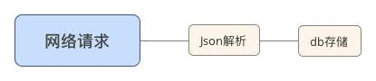
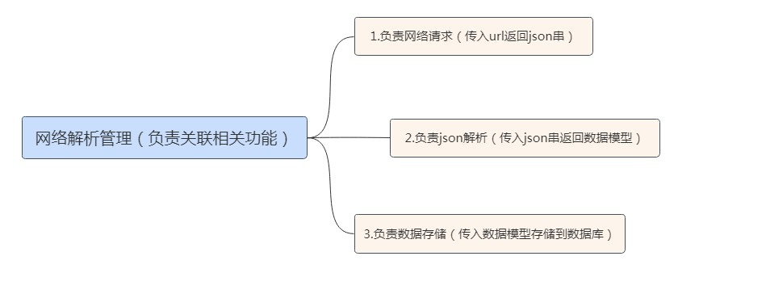

# 设计模式分享

**提高重用率**

>六大原则：单一职责原则、里氏替换原则、依赖倒置原则、迪米特法则、开闭原则

## 单一职责

*适用范围：接口、方法、类*

问题由来：方法T负责两个不同的职责：职责P1，职责P2。当由于职责P1需求发生改变而需要修改方法T时，有可能会导致原本运行正常的职责P2功能发生故障。

解决方案：遵循单一职责原则。分别建立两个方法T1、T2，使T1完成职责P1功能，T2完成职责P2功能。这样，当修改方法T1时，不会使职责P2发生故障风险；同理，当修改T2时，也不会使职责P1发生故障风险。

**如何知道一个对象的多个行为构造多个职责还是单个职责？**
我们可以通过参考角色刻板印象(Role Stereotypes)的概念来决定，提出了如下Role Stereotypes来区分职责：

>Information holder – 该对象设计为存储对象并提供对象信息给其它对象。(如data)

>Structurer – 该对象设计为维护对象和信息之间的关系

>Service provider – 该对象设计为处理工作并提供服务给其它对象（如组件）

>Controller – 该对象设计为控制决策一系列负责的任务处理（如事件）

>Coordinator – 该对象不做任何决策处理工作，只是委派工作到其它对象上 (事件委托)

>Interfacer – 该对象设计为在系统的各个部分转化信息（或请求）

####直接举例子
从网络上请求下来数据，然后储存到本地数据库中，整个需求下来应该是这样的：

这里网络请求模块，里面包含了3个职责：
- 根据url返回json数据
- 解析json数据
- 储存到本地数据库。

**这样做的问题：**

> - 逻辑上耦合度太高，无论是修改网络请求、Json解析、db存储，都不能保证不对其他模块产生影响。
> - 代码适应能力差，针对每个接口，都要设计一个全套的网络处理结构。
> - 当业务庞大后，不宜于维护。

使用单一职责原则改变结构如下：

**这样改变之后：**

> - 网络解析管理只负责模块的连接，只负责流程逻辑不负责具体实现。（维护对象和信息之间的关系）
> - 网络请求模块只负责网络请求，所有网络请求的配置以及异常判断都在这里。
> - Json解析模块只负责Json解析，String转化为具体的模型，不止可以供db模块使用，也可以供UI模块使用。
> - 数据存储模块只负责数据存储，里面涉及拆分模型以及具体的存储。

**这样做的好处：**

> - 解决了耦合度问题，不同模块只与管理模块产生关系，碰到模块协调问题只需修改管理模块逻辑。
> - 代码适应能力强，各功能模块也可以复用。
> - 易于修改，比方说Json解析出现问题，那么只需要修改Json解析模块就可以了。

单一职责原则有两个必备条件：

**1、模块功能单一**
如同上面的例子，网络请求只负责网络请求，不负责Json解析和数据存储。

**2、改变模块的原因唯一**
如同上面的例子中的网络请求模块，当数据库存储方式发生改变，网络请求不需要改变; Json解析规则发生改变，网络请求也不需要改变; 当切仅当网络请求规则发生改变的时候，才需要修改网络请求模块。

*无需为了遵守单一原则而使代码量增多，对于项目较小的或者功能不会复用的一些代码可以不用单一职责原则*
*但是对于功能复杂，需要长期迭代的项目，单一原则的使用对后期维护，功能复用等有很大用处*